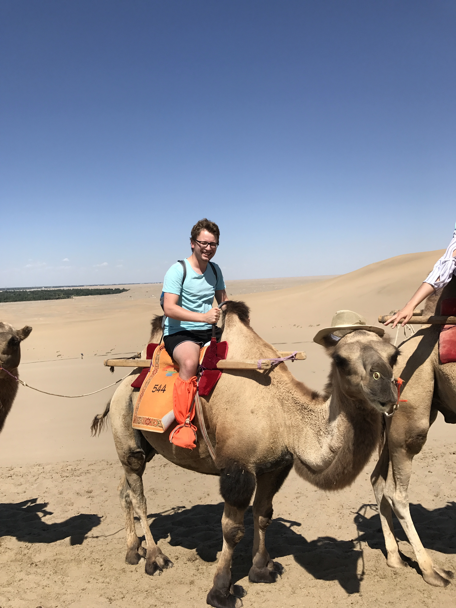

---
output:
  pdf_document: default
  html_document: default
---
# STAT545-hw01-barton-alistair

## Introduction to Alistair

I'm a math grad student taking this course to learn useful stuff.

Here's a list of some *less* useful stuff I like: 

* sports

(fun fact, I was actually at this game)

* philosophy (really reading, but I don't have any good photos for that)

* food

This summer I spent a month [here](https://www.lonelyplanet.com/china). To prove it, here's a photo of me on a stylish camel (wearing even more stylish footwear):

**Process:** I edited in browser at the beginning, but touched things up locally. Used [GitHub Guides](https://guides.github.com/) and [StackOverflow](https://stackoverflow.com/) to help. Had trouble getting photos to a reasonable size using markdown, realized I could do it via html by StackOverflow, but decided against it because you can't view it in browser. Used some help from [Jenny Bryan's github](https://github.com/jennybc/gapminder) for manipulating the Gapminder dataset (in particular for the `group_by()` function).
