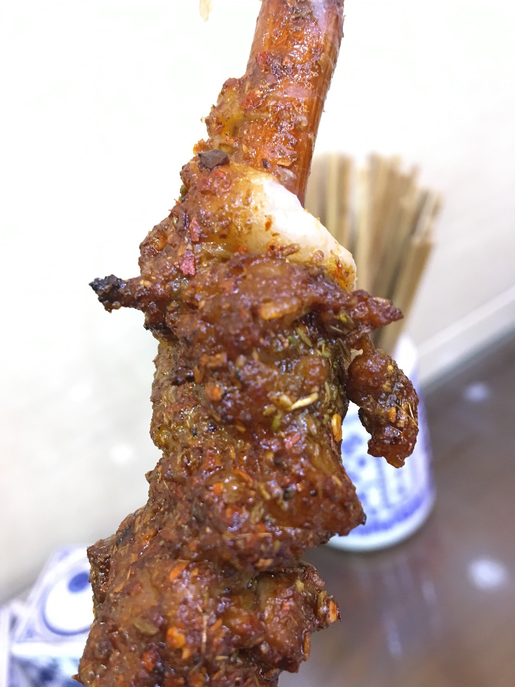

# STAT545-hw01-barton-alistair

## Introduction to Alistair

I'm a math grad student taking this course to learn useful stuff.

Here's a list of some *less* useful stuff I like: 

* sports

* philosophy

* food

This summer I spent a month [here](https://www.lonelyplanet.com/china). To prove it, here's a photo of me on a stylish camel:

**Process:** Edited in browser. Used [GitHub Guides](https://guides.github.com/) and [StackOverflow](https://stackoverflow.com/) to help. Had trouble including photos, especially resizing them.
