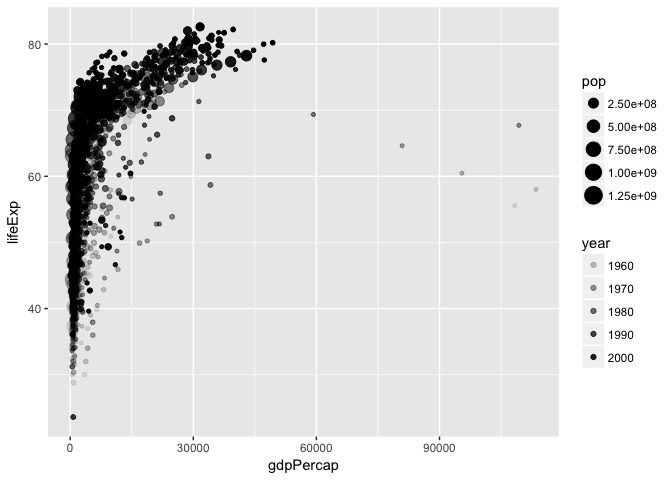
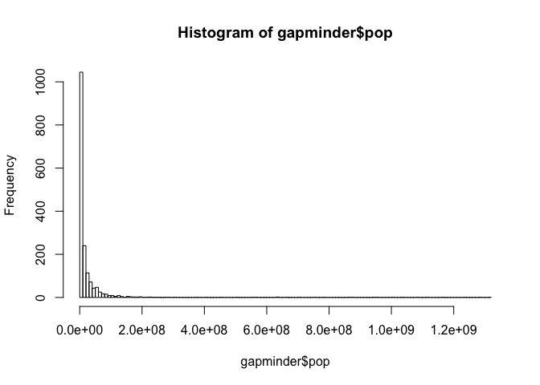
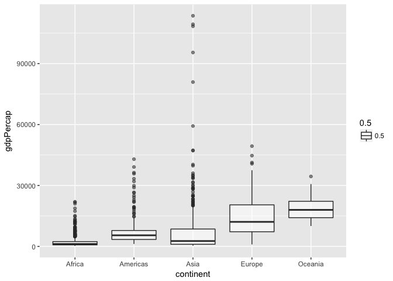
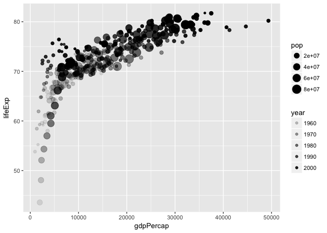

# Assignment 2


Loading packages:


```r
suppressPackageStartupMessages(library(tidyverse))
suppressPackageStartupMessages(library(gapminder))
```
## Smell test the data

Is it a data.frame, a matrix, a vector, a list?


```r
typeof(gapminder)
```

```
## [1] "list"
```

1. `gapminder` is a list.

What’s its class?


```r
class(gapminder)
```

```
## [1] "tbl_df"     "tbl"        "data.frame"
```

2. `gapminder`'s class is first "tbl_df", second "tbl" and third "data.frame", defining which functions one can apply to it and how each function apply itself to it.

How many variables/columns?


```r
ncol(gapminder)
```

```
## [1] 6
```

3. 6 columns

How many rows/observations?


```r
nrow(gapminder)
```

```
## [1] 1704
```

4. 1704 rows

Can you get these facts about “extent” or “size” in more than one way? 

5. Yes, through `length()` function, or `dim()`.


Can you imagine different functions being useful in different contexts?

6. `dim()` returns both dimensions at once which would be quicker for answering questions 3,4. However `nrow()` and `ncol()` return a scalar which might be more useful if you're using the dimensions in a function or loop. `length()` might be useful for lists or one dimensional arrays (which `NROW()` and `NCOL()` work on, unlike `nrow()` and `ncol()`) if you're unsure if they are column or row vectors.

What data type is each variable?


```r
glimpse(gapminder)
```

```
## Observations: 1,704
## Variables: 6
## $ country   <fctr> Afghanistan, Afghanistan, Afghanistan, Afghanistan,...
## $ continent <fctr> Asia, Asia, Asia, Asia, Asia, Asia, Asia, Asia, Asi...
## $ year      <int> 1952, 1957, 1962, 1967, 1972, 1977, 1982, 1987, 1992...
## $ lifeExp   <dbl> 28.801, 30.332, 31.997, 34.020, 36.088, 38.438, 39.8...
## $ pop       <int> 8425333, 9240934, 10267083, 11537966, 13079460, 1488...
## $ gdpPercap <dbl> 779.4453, 820.8530, 853.1007, 836.1971, 739.9811, 78...
```

7. We can see that *country* and *continent* are factors, *year* and *pop* are integers, while *lifeExp* and *gdpPercap* are doubles.

## Explore individual variables

I will explore (a) the continent and (b) the population variables.


```r
summary(gapminder$continent)
```

```
##   Africa Americas     Asia   Europe  Oceania 
##      624      300      396      360       24
```


1a. The range of variables for the continent variable are Africa, Americas, Asia, Europe and Oceania.

2a. The most frequent value is Africa, occuring 624 times. 


```r
summary(gapminder$pop)
```

```
##      Min.   1st Qu.    Median      Mean   3rd Qu.      Max. 
## 6.001e+04 2.794e+06 7.024e+06 2.960e+07 1.959e+07 1.319e+09
```

```r
sd(gapminder$pop)
```

```
## [1] 106157897
```

1b. The range of the population variable is about 60 thousand to 1.319 billion.

2b. We can see that the population variable has a mean of 29.6 million with a standard deviation of 106 million. This is a little misleading as the distribution has a large skew as we will see in the next section.


## Explore plot types

1. Scatterplot of life expectancy and GDP (with additional factors represented in the transparency and size of points):


```r
p <- ggplot(gapminder, aes(x=gdpPercap,y=lifeExp))
p + geom_point(aes(size = pop, alpha = year))
```

<!-- -->


2. Plot of quantitative variable: a scatterplot to showcase the extreme skew in population leading to a misleading mean. Note that the population values go all the way to the right side of the graph despite being barely visible.


```r
hist(gapminder$pop,breaks = 100)
```

<!-- -->

3. A boxplot of wealth on each continent:


```r
ggplot(gapminder, aes(x = continent, y = gdpPercap)) + geom_boxplot(aes(alpha = 0.5))
```

<!-- -->

This shows oceania and europe are significantly wealthier than the other continents, while Africa is rather consistently poor.

## Use filter(), select() and %>%

I'm curious about how our earlier life expectancy vs gdp graph looks like once we filter for the wealthier continents (according to the above boxplot) in this time frame:


```r
gapminder %>% 
  filter(continent %in% c('Europe','Oceania')) %>% 
  ggplot(aes(x = gdpPercap, y = lifeExp)) + geom_point(aes(size = pop, alpha = year))
```

<!-- -->

Here we can see a much more pronounced pattern in the data, with most outliers being small countries and/or early in the dataset.

In order to see how Canada has changed over the years:


```r
gapminder %>% 
  filter(country == 'Canada') %>% 
  select(-continent, -country)
```

```
## # A tibble: 12 x 4
##     year lifeExp      pop gdpPercap
##    <int>   <dbl>    <int>     <dbl>
##  1  1952  68.750 14785584  11367.16
##  2  1957  69.960 17010154  12489.95
##  3  1962  71.300 18985849  13462.49
##  4  1967  72.130 20819767  16076.59
##  5  1972  72.880 22284500  18970.57
##  6  1977  74.210 23796400  22090.88
##  7  1982  75.760 25201900  22898.79
##  8  1987  76.860 26549700  26626.52
##  9  1992  77.950 28523502  26342.88
## 10  1997  78.610 30305843  28954.93
## 11  2002  79.770 31902268  33328.97
## 12  2007  80.653 33390141  36319.24
```

The population seems to consistently rise about 1-2 million while the life expentancy and GDP per capita are steadily increasing (aside from a small set back in GDP per capita in 1987-1982).

We can also check out the economic power of each continent:


```r
gapminder %>% 
  mutate(GDP = gdpPercap*pop) %>% 
  group_by(continent) %>% 
  summarise(sum(GDP), mean(GDP))
```

```
## # A tibble: 5 x 3
##   continent   `sum(GDP)`  `mean(GDP)`
##      <fctr>        <dbl>        <dbl>
## 1    Africa 1.304458e+13  20904782844
## 2  Americas 1.137787e+14 379262350210
## 3      Asia 8.998456e+13 227233738153
## 4    Europe 9.699915e+13 269442085301
## 5   Oceania 4.516491e+12 188187105354
```
## I want to do more


```r
gapminder %>% 
  filter(country == c("Rwanda", "Afghanistan"))
```

```
## # A tibble: 12 x 6
##        country continent  year lifeExp      pop gdpPercap
##         <fctr>    <fctr> <int>   <dbl>    <int>     <dbl>
##  1 Afghanistan      Asia  1957  30.332  9240934  820.8530
##  2 Afghanistan      Asia  1967  34.020 11537966  836.1971
##  3 Afghanistan      Asia  1977  38.438 14880372  786.1134
##  4 Afghanistan      Asia  1987  40.822 13867957  852.3959
##  5 Afghanistan      Asia  1997  41.763 22227415  635.3414
##  6 Afghanistan      Asia  2007  43.828 31889923  974.5803
##  7      Rwanda    Africa  1952  40.000  2534927  493.3239
##  8      Rwanda    Africa  1962  43.000  3051242  597.4731
##  9      Rwanda    Africa  1972  44.600  3992121  590.5807
## 10      Rwanda    Africa  1982  46.218  5507565  881.5706
## 11      Rwanda    Africa  1992  23.599  7290203  737.0686
## 12      Rwanda    Africa  2002  43.413  7852401  785.6538
```

So it seems like they get data for both Afghanistan and Rwanda, but for alternating time frames (e.g. they get Rwanda for 1952 but not 1957 and Afghanistan in 1957 but not 1952). The correct way to do this would be 


```r
gapminder %>% 
  filter(country %in% c("Rwanda", "Afghanistan")) 
```

```
## # A tibble: 24 x 6
##        country continent  year lifeExp      pop gdpPercap
##         <fctr>    <fctr> <int>   <dbl>    <int>     <dbl>
##  1 Afghanistan      Asia  1952  28.801  8425333  779.4453
##  2 Afghanistan      Asia  1957  30.332  9240934  820.8530
##  3 Afghanistan      Asia  1962  31.997 10267083  853.1007
##  4 Afghanistan      Asia  1967  34.020 11537966  836.1971
##  5 Afghanistan      Asia  1972  36.088 13079460  739.9811
##  6 Afghanistan      Asia  1977  38.438 14880372  786.1134
##  7 Afghanistan      Asia  1982  39.854 12881816  978.0114
##  8 Afghanistan      Asia  1987  40.822 13867957  852.3959
##  9 Afghanistan      Asia  1992  41.674 16317921  649.3414
## 10 Afghanistan      Asia  1997  41.763 22227415  635.3414
## # ... with 14 more rows
```

