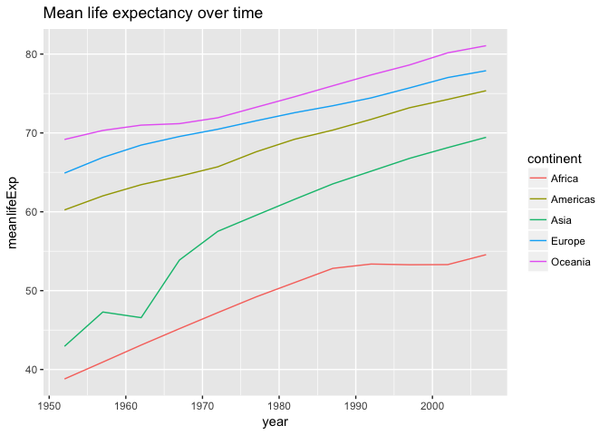

# Assignment 3


Loading packages:


```r
suppressPackageStartupMessages(library(tidyverse))
suppressPackageStartupMessages(library(gapminder))
```

>Get the maximum and minimum of GDP per capita for all continents.


```r
gapminder %>% 
  group_by(continent) %>% 
  summarise(maxGDPpcap = max(gdpPercap), minGDPpcap = min(gdpPercap))
```

```
## # A tibble: 5 x 3
##   continent maxGDPpcap minGDPpcap
##      <fctr>      <dbl>      <dbl>
## 1    Africa   21951.21   241.1659
## 2  Americas   42951.65  1201.6372
## 3      Asia  113523.13   331.0000
## 4    Europe   49357.19   973.5332
## 5   Oceania   34435.37 10039.5956
```

> Look at the spread of GDP per capita within the continents.


```r
gapminder %>% 
  group_by(continent) %>% 
  summarise(GDPspread = max(gdpPercap) - min(gdpPercap))
```

```
## # A tibble: 5 x 2
##   continent GDPspread
##      <fctr>     <dbl>
## 1    Africa  21710.05
## 2  Americas  41750.02
## 3      Asia 113192.13
## 4    Europe  48383.66
## 5   Oceania  24395.77
```

> Compute a trimmed mean of life expectancy for different years. Or a weighted mean, weighting by population. Just try something other than the plain vanilla mean.


```r
gapminder %>% 
  mutate(yearslived = lifeExp*pop) %>% # total years lived in each country
  group_by(year) %>% 
  summarise(meanlifeExp = sum(as.numeric(yearslived))/sum(as.numeric(pop))) # weighted average
```

```
## # A tibble: 12 x 2
##     year meanlifeExp
##    <int>       <dbl>
##  1  1952    48.94424
##  2  1957    52.12189
##  3  1962    52.32438
##  4  1967    56.98431
##  5  1972    59.51478
##  6  1977    61.23726
##  7  1982    62.88176
##  8  1987    64.41635
##  9  1992    65.64590
## 10  1997    66.84934
## 11  2002    67.83904
## 12  2007    68.91909
```


> How is life expectancy changing over time on different continents?


```r
# create dataset with continent, year, and weighted average of life expectancy 
conts <- gapminder %>% 
  mutate(yearslived = lifeExp*pop) %>%
  group_by(continent,year) %>% 
  summarise(meanlifeExp = sum(as.numeric(yearslived))/sum(as.numeric(pop))) 

# plot with colours indicating continent
p <- ggplot(conts, aes(x = year, y = meanlifeExp))
p + geom_point(aes(colour = continent))
```

<!-- -->

We can see that all the continents have improved significantly, especially Asia (aside from a brief fall in 1962) with Africa slowing down since 1990. 

> Report the absolute and/or relative abundance of countries with low life expectancy over time by continent: Compute some measure of worldwide life expectancy – you decide – a mean or median or some other quantile or perhaps your current age. Then determine how many countries on each continent have a life expectancy less than this benchmark, for each year.

I will choose the benchmark of my father's age of 57. This makes the data more meaningful as I cannot imagine living in a country where most people my age have lost a parent. 


```r
conts <- gapminder %>% 
  group_by(continent, year) %>% 
  summarise(lowLifeExppcent = sum(lifeExp < 57)/length(lifeExp))

ggplot(conts,aes(y = lowLifeExppcent, x = year)) + geom_point(aes(colour = continent))
```

<!-- -->

We can see that Oceania hasn't had such countries during the range of this dataset while Europe and the Americas no longer have any such countries. Asia has also raised the life expectancy above 57 in almost every country. Unfortunately Africa remains the only continent far away from this level: while at the beginning of the dataset every single african country had a 'low' life expectancy, today about two thirds of african countries still have a 'low' life expectancy! 

In fact the number of african countries with a 'low' life expectancy has actually increased since 1992! This regression is somewhat obscured in the prior graph, although it does correspond to the flattening out of Africa's mean life expectancy.

> Find countries with interesting stories. Open-ended and, therefore, hard. Promising but unsuccessful attempts are encouraged. This will generate interesting questions to follow up on in class.


```r
gapminder %>% 
  filter(continent == 'Africa', year > 1990, year < 2005) %>% 
  group_by(country) %>% 
  summarise(delta = lifeExp[3]-lifeExp[1]) %>% # change in life expectancy over these years
  arrange(delta) # list with worst decreases first
```

```
## # A tibble: 52 x 2
##                     country   delta
##                      <fctr>   <dbl>
##  1                 Zimbabwe -20.388
##  2                 Botswana -16.111
##  3                  Lesotho -15.092
##  4                Swaziland -14.605
##  5                  Namibia -10.520
##  6             South Africa  -8.523
##  7                    Kenya  -8.293
##  8                   Zambia  -6.907
##  9 Central African Republic  -6.088
## 10            Cote d'Ivoire  -5.212
## # ... with 42 more rows
```

We can see that there's a concentration of these countries in southern Africa. We will Zimbabwe as our country of interest because it suffered the worst progression but is also in the geographic centre of these countries. Let's see how Zimbabwe has changed in the last half century


```r
zimbData <- filter(gapminder, country == 'Zimbabwe') 

ggplot(zimbData, aes(x = year, y = lifeExp)) + geom_point(aes(size = gdpPercap))
```

<!-- -->

We can see that there seems to be a somewhat normal progression (albeit slow GDP growth) until 1990 where this calamity hits, at which point life expectancy decreased to the lowest level since data collection began, and remains around there at the end of our data collection (culminating in a drop of almost 40% over 15 years). Interestingly GDP per capita doesn't seem to take a significant hit until 15 years after the disaster.

This downturn may be attributed to the [HIV epidemic in the region in the 90s](https://en.wikipedia.org/wiki/HIV/AIDS_in_Africa#Southern_Africa), which also affected neighbouring countries. The crash in GDP per capita in the mid-2000s seems to correlate with the worst periods of the [infamous Zimbabwe hyperinflation](https://en.wikipedia.org/wiki/Hyperinflation_in_Zimbabwe#Inflation_rate) and may also have something to do with the land reform policies around the turn of the century that (quoting wikipedia) "put [land] in the hands of inexperienced people".

> Make up your own! Between the dplyr coverage in class and the list above, I think you get the idea.


