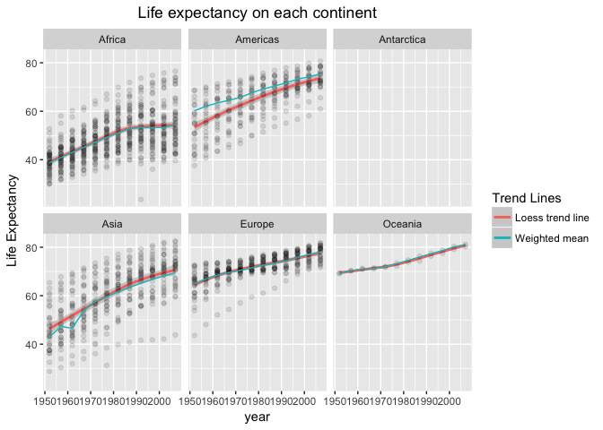
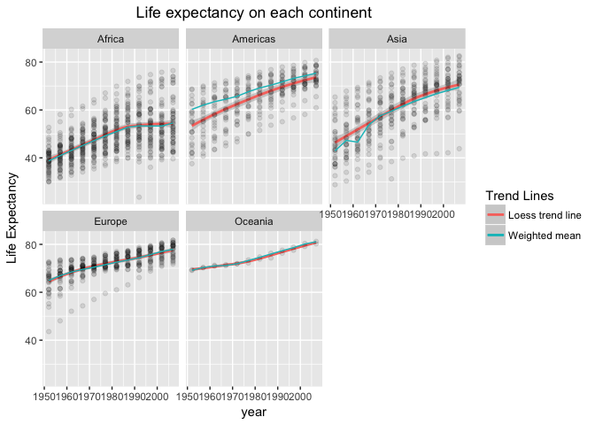

# Assignment4


```r
library(gapminder)
suppressPackageStartupMessages(library(tidyverse))
```


## General data reshaping and relationship to aggregation


## Join, merge, look up (Activity #1)

In the last assignment I had wanted to superimpose a line plot corresponding to the weighted mean of the life expectancy on top of a graph of life expectancy. I didn't know how to do it at the time, but I bet I can use a join function to do it now!

I will use `full_join()` to supplement my data in __Step 1__ and join with gapminder data __Step 2__. In __Step 3__ I plot the results, while in __Step 4__ I explore other `_join()` functions (`left_join()`, `anti_join()`).

### Step 1: create complementary dataframe

The first step is to create a dataframe that lists the weighted mean life expectancy for each continent and year:


```r
weightLifeExp <- gapminder %>%
  mutate(yearsLived = lifeExp*pop) %>% 
  group_by(year,continent) %>% 
  summarise(meanLifeExp = sum(as.numeric(yearsLived))
            /sum(as.numeric(pop)))

head(weightLifeExp)
```

```
## # A tibble: 6 x 3
## # Groups:   year [2]
##    year continent meanLifeExp
##   <int>    <fctr>       <dbl>
## 1  1952    Africa    38.79973
## 2  1952  Americas    60.23599
## 3  1952      Asia    42.94114
## 4  1952    Europe    64.90540
## 5  1952   Oceania    69.17040
## 6  1957    Africa    40.94031
```

For fun, I will also include (via a `full_join` function!) Antarctica with life expectancy *NA* in the dataset (to make the different types of joins non-trivial).


```r
# create Antarctica
Antarctica <- gapminder %>% 
  filter(country == "Canada") %>% 
  select(year) %>% # Just get a sequence of the years we have data for
  mutate(continent = factor('Antarctica'), penguins = floor(10^(8*2000/jitter(year))/jitter(year)))

# integrate Antarctica into the data
weightLifeExp <- weightLifeExp %>% 
  full_join(Antarctica) %>% 
  arrange(year, continent)
```

```
## Joining, by = c("year", "continent")
```

```
## Warning: Column `continent` joining factors with different levels, coercing
## to character vector
```

```r
head(weightLifeExp)
```

```
## # A tibble: 6 x 4
## # Groups:   year [1]
##    year  continent meanLifeExp penguins
##   <int>      <chr>       <dbl>    <dbl>
## 1  1952     Africa    38.79973       NA
## 2  1952   Americas    60.23599       NA
## 3  1952 Antarctica          NA    80192
## 4  1952       Asia    42.94114       NA
## 5  1952     Europe    64.90540       NA
## 6  1952    Oceania    69.17040       NA
```


### Step 2: join data frames

Now we can join the two dataframes using `_join` functions (I also remove the GDP column for compactness):

```r
meanlifegap <- gapminder %>% 
  full_join(weightLifeExp) %>% 
  select(-gdpPercap)
```

```
## Joining, by = c("continent", "year")
```

```
## Warning: Column `continent` joining factor and character vector, coercing
## into character vector
```

```r
head(meanlifegap)
```

```
## # A tibble: 6 x 7
##       country continent  year lifeExp      pop meanLifeExp penguins
##        <fctr>     <chr> <int>   <dbl>    <int>       <dbl>    <dbl>
## 1 Afghanistan      Asia  1952  28.801  8425333    42.94114       NA
## 2 Afghanistan      Asia  1957  30.332  9240934    47.28835       NA
## 3 Afghanistan      Asia  1962  31.997 10267083    46.57369       NA
## 4 Afghanistan      Asia  1967  34.020 11537966    53.88261       NA
## 5 Afghanistan      Asia  1972  36.088 13079460    57.52159       NA
## 6 Afghanistan      Asia  1977  38.438 14880372    59.55648       NA
```


### Step 3: make plot

Not one of the steps suggested by the assignment, but I personally wanted to redo the plot from my last assignment and see how the weighted mean compared to the `loess` trend line:


```r
ggplot(meanlifegap, aes(year, lifeExp)) + facet_wrap(~ continent) +
  geom_smooth(aes(color = 'blue'), method = loess, show.legend = T) +
  geom_point(alpha = 0.1) + 
  geom_line(aes(x = year, y = meanLifeExp, color = 'red'), show.legend = T) +
  labs(title = 'Life expectancy on each continent', y = 'Life Expectancy') +
  scale_color_discrete(name = "Trend Lines", labels = c("Loess trend line", "Weighted mean")) +
  theme(plot.title = element_text(hjust = 0.5))
```

```
## Warning: Removed 12 rows containing non-finite values (stat_smooth).
```

```
## Warning: Removed 12 rows containing missing values (geom_point).
```

<!-- -->

We can see that they generally agree, but diverge pretty badly in the Americas and Asia at the beginning of the dataset. We can also see that the use of `full_join()` created an empty Antarctica graph (because all of those values are *NA*), and gave us the error message. 

### Step 4: explore different types of joins

We can quickly double check that Antarctica is the only continent unrepresented in the gapminder database using `inner_join()`:


```r
anti_join(weightLifeExp, gapminder)
```

```
## Joining, by = c("year", "continent")
```

```
## Warning: Column `continent` joining character vector and factor, coercing
## into character vector
```

```
## # A tibble: 12 x 4
## # Groups:   year [?]
##     year  continent meanLifeExp penguins
##    <int>      <chr>       <dbl>    <dbl>
##  1  1952 Antarctica          NA    80192
##  2  1957 Antarctica          NA    76699
##  3  1962 Antarctica          NA    72358
##  4  1967 Antarctica          NA    69377
##  5  1972 Antarctica          NA    65260
##  6  1977 Antarctica          NA    62139
##  7  1982 Antarctica          NA    59430
##  8  1987 Antarctica          NA    56415
##  9  1992 Antarctica          NA    54069
## 10  1997 Antarctica          NA    51400
## 11  2002 Antarctica          NA    48814
## 12  2007 Antarctica          NA    46613
```

```r
anti_join(gapminder, weightLifeExp)
```

```
## Joining, by = c("continent", "year")
```

```
## Warning: Column `continent` joining factor and character vector, coercing
## into character vector
```

```
## # A tibble: 0 x 6
## # ... with 6 variables: country <fctr>, continent <fctr>, year <int>,
## #   lifeExp <dbl>, pop <int>, gdpPercap <dbl>
```

This shows us that the only rows in `weightLifeExp` with continent and year not in `gapminder` are Antarctica, while there are no rows in `gapminder` with either continent or year not in `weightLifeExp`.

If we wanted to get rid of the empty antarctica plot we could use `left_join()`:


```r
meanlifegap <- left_join(gapminder, weightLifeExp)
```

```
## Joining, by = c("continent", "year")
```

```
## Warning: Column `continent` joining factor and character vector, coercing
## into character vector
```

```r
ggplot(meanlifegap, aes(year, lifeExp)) + facet_wrap(~ continent) +
  geom_smooth(aes(color = 'blue'), method = loess, show.legend = T) +
  geom_point(alpha = 0.1) + 
  geom_line(aes(x = year, y = meanLifeExp, color = 'red'), show.legend = T) +
  labs(title = 'Life expectancy on each continent', y = 'Life Expectancy') +
  scale_color_discrete(name = "Trend Lines", labels = c("Loess trend line", "Weighted mean")) +
  theme(plot.title = element_text(hjust = 0.5))
```

<!-- -->

To explore the rest of the functions I'm going to trucate data quite a bit by considering only Canadian data after the centennial:


```r
Canada100 <- gapminder %>%
  filter(country == 'Canada', year >= 1967)
```

We can see what data in `weightLifeExp` corresponds to this new dataset by using the `semi_join()` function:


```r
semi_join(weightLifeExp, Canada100)
```

```
## Joining, by = c("year", "continent")
```

```
## Warning: Column `continent` joining character vector and factor, coercing
## into character vector
```

```
## # A tibble: 9 x 4
## # Groups:   year [?]
##    year continent meanLifeExp penguins
##   <int>     <chr>       <dbl>    <dbl>
## 1  1967  Americas    64.50630       NA
## 2  1972  Americas    65.70490       NA
## 3  1977  Americas    67.60591       NA
## 4  1982  Americas    69.19264       NA
## 5  1987  Americas    70.35814       NA
## 6  1992  Americas    71.72177       NA
## 7  1997  Americas    73.19154       NA
## 8  2002  Americas    74.24736       NA
## 9  2007  Americas    75.35668       NA
```

Likewise, if we want to see all the data we have corresponding to this dataset, we can use the `inner_join()` function:


```r
inner_join(weightLifeExp, Canada100)
```

```
## Joining, by = c("year", "continent")
```

```
## Warning: Column `continent` joining character vector and factor, coercing
## into character vector
```

```
## # A tibble: 9 x 8
## # Groups:   year [?]
##    year continent meanLifeExp penguins country lifeExp      pop gdpPercap
##   <int>     <chr>       <dbl>    <dbl>  <fctr>   <dbl>    <int>     <dbl>
## 1  1967  Americas    64.50630       NA  Canada  72.130 20819767  16076.59
## 2  1972  Americas    65.70490       NA  Canada  72.880 22284500  18970.57
## 3  1977  Americas    67.60591       NA  Canada  74.210 23796400  22090.88
## 4  1982  Americas    69.19264       NA  Canada  75.760 25201900  22898.79
## 5  1987  Americas    70.35814       NA  Canada  76.860 26549700  26626.52
## 6  1992  Americas    71.72177       NA  Canada  77.950 28523502  26342.88
## 7  1997  Americas    73.19154       NA  Canada  78.610 30305843  28954.93
## 8  2002  Americas    74.24736       NA  Canada  79.770 31902268  33328.97
## 9  2007  Americas    75.35668       NA  Canada  80.653 33390141  36319.24
```

### Step 5 (Activity #3): `merge()` and `match()`
