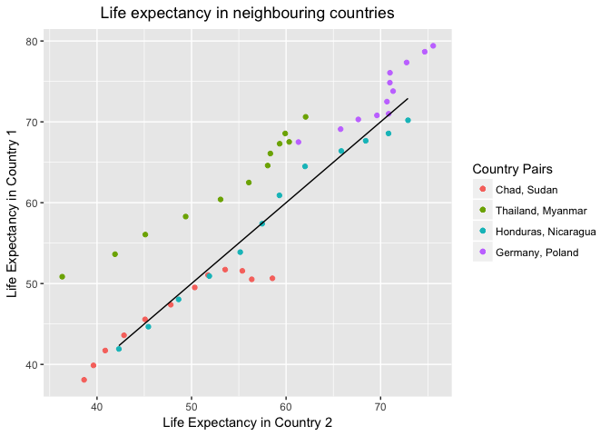
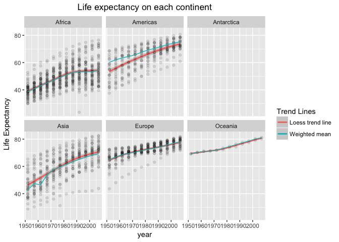
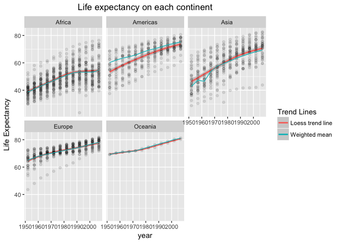

# Assignment4


```r
knitr::opts_chunk$set(echo = TRUE)
options(knitr.table.format = 'markdown')
```


```r
library(gapminder)
suppressPackageStartupMessages(library(tidyverse))
```


## General data reshaping and relationship to aggregation (Activity #3)

I want to compare how neighbouring countries relate to eachother so I selected a pair of neighbours from each continent, except Australia:


```r
Neighbours <- gapminder %>% 
  filter(country %in% c("Honduras", "Nicaragua","Sudan", "Chad", "Myanmar", "Thailand", "Poland", "Germany")) %>% 
  select(-gdpPercap,-pop,-continent)
```

We can see that there's a pretty good correspondence between Nicaragua and Honduras, and Sudan and Chad:


```r
NeighLife <- Neighbours %>% 
  group_by(year) %>% 
  spread(country, lifeExp)

knitr::kable(NeighLife)
```


| year|   Chad| Germany| Honduras| Myanmar| Nicaragua| Poland|  Sudan| Thailand|
|----:|------:|-------:|--------:|-------:|---------:|------:|------:|--------:|
| 1952| 38.092|  67.500|   41.912|  36.319|    42.314| 61.310| 38.635|   50.848|
| 1957| 39.881|  69.100|   44.665|  41.905|    45.432| 65.770| 39.624|   53.630|
| 1962| 41.716|  70.300|   48.041|  45.108|    48.632| 67.640| 40.870|   56.061|
| 1967| 43.601|  70.800|   50.924|  49.379|    51.884| 69.610| 42.858|   58.285|
| 1972| 45.569|  71.000|   53.884|  53.070|    55.151| 70.850| 45.083|   60.405|
| 1977| 47.383|  72.500|   57.402|  56.059|    57.470| 70.670| 47.800|   62.494|
| 1982| 49.517|  73.800|   60.909|  58.056|    59.298| 71.320| 50.338|   64.597|
| 1987| 51.051|  74.847|   64.492|  58.339|    62.008| 70.980| 51.744|   66.084|
| 1992| 51.724|  76.070|   66.399|  59.320|    65.843| 70.990| 53.556|   67.298|
| 1997| 51.573|  77.340|   67.659|  60.328|    68.426| 72.750| 55.373|   67.521|
| 2002| 50.525|  78.670|   68.565|  59.908|    70.836| 74.670| 56.369|   68.564|
| 2007| 50.651|  79.406|   70.198|  62.069|    72.899| 75.563| 58.556|   70.616|

But it might be easier to compare if we plot their life expectancies against eachother:


```r
ggplot(NeighLife, aes(Sudan, Chad)) + geom_point(aes(color = 'blue')) +
  geom_point(aes(Nicaragua, Honduras, color = 'red')) +
  geom_point(aes(Myanmar, Thailand, color = 'green')) +
  geom_point(aes(Poland, Germany, color = 'yellow')) +
  labs(title = 'Life expectancy in neighbouring countries', y = 'Life Expectancy in Country 1', x = 'Life Expectancy in Country 2') +
  scale_color_discrete(name = "Country Pairs", labels = c("Chad, Sudan", "Thailand, Myanmar", "Honduras, Nicaragua", "Germany, Poland")) +
  theme(plot.title = element_text(hjust = 0.5)) +
  geom_line(aes(Nicaragua, Nicaragua))
```

<!-- -->

Comparing with the black line (indicating equal life expectancy), we see that Nicaragua and Honduras do match almost identically, same with Sudan and Chad, at least until the recent stalling in Chad's life expectancy which perplexingly seems to correspond to the end of their civil war...

There generally seems to be a high level of correspondance in the data, with Thailand and Myanmar seeming to be the only major deviation.

## Join, merge, look up (Activity #1)

In the last assignment I had wanted to superimpose a line plot corresponding to the weighted mean of the life expectancy on top of a graph of life expectancy. I didn't know how to do it at the time, but I bet I can use a join function to do it now!

I will use `full_join()` to supplement my data in __Step 1__ and join with gapminder data __Step 2__. In __Step 3__ I plot the results, while in __Step 4__ I explore other `_join()` functions (`left_join()`, `anti_join()`).

### Step 1: create complementary dataframe

The first step is to create a dataframe that lists the weighted mean life expectancy for each continent and year:


```r
weightLifeExp <- gapminder %>%
  mutate(yearsLived = lifeExp*pop) %>% 
  group_by(year,continent) %>% 
  summarise(meanLifeExp = sum(as.numeric(yearsLived))
            /sum(as.numeric(pop)))

knitr::kable(head(weightLifeExp))
```


| year|continent | meanLifeExp|
|----:|:---------|-----------:|
| 1952|Africa    |    38.79973|
| 1952|Americas  |    60.23599|
| 1952|Asia      |    42.94114|
| 1952|Europe    |    64.90540|
| 1952|Oceania   |    69.17040|
| 1957|Africa    |    40.94031|

For fun, I will also include (via a `full_join` function!) Antarctica with life expectancy *NA* in the dataset (to make the different types of joins non-trivial).


```r
# create Antarctica
Antarctica <- gapminder %>% 
  filter(country == "Canada") %>% 
  select(year) %>% # Just get a sequence of the years we have data for
  mutate(continent = factor('Antarctica'), penguins = floor(10^(10*2000/jitter(year))/jitter(year)))

# integrate Antarctica into the data
weightLifeExp <- weightLifeExp %>% 
  full_join(Antarctica) %>% 
  arrange(year, continent)
```

```
## Joining, by = c("year", "continent")
```

```
## Warning: Column `continent` joining factors with different levels, coercing
## to character vector
```

```r
knitr::kable(head(weightLifeExp))
```


| year|continent  | meanLifeExp| penguins|
|----:|:----------|-----------:|--------:|
| 1952|Africa     |    38.79973|       NA|
| 1952|Americas   |    60.23599|       NA|
| 1952|Antarctica |          NA|  9100009|
| 1952|Asia       |    42.94114|       NA|
| 1952|Europe     |    64.90540|       NA|
| 1952|Oceania    |    69.17040|       NA|


### Step 2: join data frames

Now we can join the two dataframes using `_join` functions (I also remove the GDP column for compactness):

```r
meanlifegap <- gapminder %>% 
  full_join(weightLifeExp) %>% 
  select(-gdpPercap)
```

```
## Joining, by = c("continent", "year")
```

```
## Warning: Column `continent` joining factor and character vector, coercing
## into character vector
```

```r
knitr::kable(head(meanlifegap))
```


|country     |continent | year| lifeExp|      pop| meanLifeExp| penguins|
|:-----------|:---------|----:|-------:|--------:|-----------:|--------:|
|Afghanistan |Asia      | 1952|  28.801|  8425333|    42.94114|       NA|
|Afghanistan |Asia      | 1957|  30.332|  9240934|    47.28835|       NA|
|Afghanistan |Asia      | 1962|  31.997| 10267083|    46.57369|       NA|
|Afghanistan |Asia      | 1967|  34.020| 11537966|    53.88261|       NA|
|Afghanistan |Asia      | 1972|  36.088| 13079460|    57.52159|       NA|
|Afghanistan |Asia      | 1977|  38.438| 14880372|    59.55648|       NA|


### Step 3: make plot

Not one of the steps suggested by the assignment, but I personally wanted to redo the plot from my last assignment and see how the weighted mean compared to the `loess` trend line:


```r
ggplot(meanlifegap, aes(year, lifeExp)) + facet_wrap(~ continent) +
  geom_smooth(aes(color = 'blue'), method = loess, show.legend = T) +
  geom_point(alpha = 0.1) + 
  geom_line(aes(x = year, y = meanLifeExp, color = 'red'), show.legend = T) +
  labs(title = 'Life expectancy on each continent', y = 'Life Expectancy') +
  scale_color_discrete(name = "Trend Lines", labels = c("Loess trend line", "Weighted mean")) +
  theme(plot.title = element_text(hjust = 0.5))
```

```
## Warning: Removed 12 rows containing non-finite values (stat_smooth).
```

```
## Warning: Removed 12 rows containing missing values (geom_point).
```

<!-- -->

We can see that they generally agree, but diverge pretty badly in the Americas and Asia at the beginning of the dataset. We can also see that the use of `full_join()` created an empty Antarctica graph (because all of those values are *NA*), and gave us the warning message. 

### Step 4: explore different types of joins

We can quickly double check that Antarctica is the only continent unrepresented in the `gapminder` database using `anti_join()`:


```r
knitr::kable(anti_join(weightLifeExp, gapminder))
```

```
## Joining, by = c("year", "continent")
```

```
## Warning: Column `continent` joining character vector and factor, coercing
## into character vector
```


| year|continent  | meanLifeExp| penguins|
|----:|:----------|-----------:|--------:|
| 1952|Antarctica |          NA|  9100009|
| 1957|Antarctica |          NA|  8535049|
| 1962|Antarctica |          NA|  8053513|
| 1967|Antarctica |          NA|  7468249|
| 1972|Antarctica |          NA|  7106433|
| 1977|Antarctica |          NA|  6536026|
| 1982|Antarctica |          NA|  6196735|
| 1987|Antarctica |          NA|  5835794|
| 1992|Antarctica |          NA|  5510243|
| 1997|Antarctica |          NA|  5128566|
| 2002|Antarctica |          NA|  4879044|
| 2007|Antarctica |          NA|  4619510|

Similarly, we can see that there is no `gapminder` data whose year/continent is not represented in the `weightLifeExp` dataset:


```r
knitr::kable(anti_join(gapminder, weightLifeExp))
```

```
## Joining, by = c("continent", "year")
```

```
## Warning: Column `continent` joining factor and character vector, coercing
## into character vector
```


|country |continent | year| lifeExp| pop| gdpPercap|
|:-------|:---------|----:|-------:|---:|---------:|

This shows us that the only rows in `weightLifeExp` with continent and year not in `gapminder` are Antarctica, while there are no rows in `gapminder` with either continent or year not in `weightLifeExp`.

If we wanted to get rid of the empty antarctica plot we could use `left_join()`:


```r
meanlifegap <- left_join(gapminder, weightLifeExp)
```

```
## Joining, by = c("continent", "year")
```

```
## Warning: Column `continent` joining factor and character vector, coercing
## into character vector
```

which removes Antarctica from the plot:

<!-- -->

To explore the rest of the functions I'm going to trucate data quite a bit by considering only Canadian data after the centennial:


```r
Canada100 <- gapminder %>%
  filter(country == 'Canada', year >= 1967)
```

We can see what data in `weightLifeExp` corresponds to this new dataset by using the `semi_join()` function:


```r
knitr::kable(semi_join(weightLifeExp, Canada100))
```

```
## Joining, by = c("year", "continent")
```

```
## Warning: Column `continent` joining character vector and factor, coercing
## into character vector
```


| year|continent | meanLifeExp| penguins|
|----:|:---------|-----------:|--------:|
| 1967|Americas  |    64.50630|       NA|
| 1972|Americas  |    65.70490|       NA|
| 1977|Americas  |    67.60591|       NA|
| 1982|Americas  |    69.19264|       NA|
| 1987|Americas  |    70.35814|       NA|
| 1992|Americas  |    71.72177|       NA|
| 1997|Americas  |    73.19154|       NA|
| 2002|Americas  |    74.24736|       NA|
| 2007|Americas  |    75.35668|       NA|

Likewise, if we want to see all the data we have corresponding to this dataset, we can use the `inner_join()` function:


```r
knitr::kable(inner_join(weightLifeExp, Canada100))
```

```
## Joining, by = c("year", "continent")
```

```
## Warning: Column `continent` joining character vector and factor, coercing
## into character vector
```


| year|continent | meanLifeExp| penguins|country | lifeExp|      pop| gdpPercap|
|----:|:---------|-----------:|--------:|:-------|-------:|--------:|---------:|
| 1967|Americas  |    64.50630|       NA|Canada  |  72.130| 20819767|  16076.59|
| 1972|Americas  |    65.70490|       NA|Canada  |  72.880| 22284500|  18970.57|
| 1977|Americas  |    67.60591|       NA|Canada  |  74.210| 23796400|  22090.88|
| 1982|Americas  |    69.19264|       NA|Canada  |  75.760| 25201900|  22898.79|
| 1987|Americas  |    70.35814|       NA|Canada  |  76.860| 26549700|  26626.52|
| 1992|Americas  |    71.72177|       NA|Canada  |  77.950| 28523502|  26342.88|
| 1997|Americas  |    73.19154|       NA|Canada  |  78.610| 30305843|  28954.93|
| 2002|Americas  |    74.24736|       NA|Canada  |  79.770| 31902268|  33328.97|
| 2007|Americas  |    75.35668|       NA|Canada  |  80.653| 33390141|  36319.24|

### Step 5 (Activity #3): Investigate `merge()` 

Let's experiment with `merge()`:


```r
knitr::kable(merge(Canada100, weightLifeExp))
```


|continent | year|country | lifeExp|      pop| gdpPercap| meanLifeExp| penguins|
|:---------|----:|:-------|-------:|--------:|---------:|-----------:|--------:|
|Americas  | 1967|Canada  |  72.130| 20819767|  16076.59|    64.50630|       NA|
|Americas  | 1972|Canada  |  72.880| 22284500|  18970.57|    65.70490|       NA|
|Americas  | 1977|Canada  |  74.210| 23796400|  22090.88|    67.60591|       NA|
|Americas  | 1982|Canada  |  75.760| 25201900|  22898.79|    69.19264|       NA|
|Americas  | 1987|Canada  |  76.860| 26549700|  26626.52|    70.35814|       NA|
|Americas  | 1992|Canada  |  77.950| 28523502|  26342.88|    71.72177|       NA|
|Americas  | 1997|Canada  |  78.610| 30305843|  28954.93|    73.19154|       NA|
|Americas  | 2002|Canada  |  79.770| 31902268|  33328.97|    74.24736|       NA|
|Americas  | 2007|Canada  |  80.653| 33390141|  36319.24|    75.35668|       NA|

We can see it collects all the data from both datasets that corresponds to Americas after 1967. This seems similar to `left_join()`. In fact if you compare below, we can see the only contrasts are that `merge()` lists the common columns first, while `left_join()` lists the columns in the first argument first:


```r
knitr::kable(left_join(Canada100, weightLifeExp))
```

```
## Joining, by = c("continent", "year")
```

```
## Warning: Column `continent` joining factor and character vector, coercing
## into character vector
```


|country |continent | year| lifeExp|      pop| gdpPercap| meanLifeExp| penguins|
|:-------|:---------|----:|-------:|--------:|---------:|-----------:|--------:|
|Canada  |Americas  | 1967|  72.130| 20819767|  16076.59|    64.50630|       NA|
|Canada  |Americas  | 1972|  72.880| 22284500|  18970.57|    65.70490|       NA|
|Canada  |Americas  | 1977|  74.210| 23796400|  22090.88|    67.60591|       NA|
|Canada  |Americas  | 1982|  75.760| 25201900|  22898.79|    69.19264|       NA|
|Canada  |Americas  | 1987|  76.860| 26549700|  26626.52|    70.35814|       NA|
|Canada  |Americas  | 1992|  77.950| 28523502|  26342.88|    71.72177|       NA|
|Canada  |Americas  | 1997|  78.610| 30305843|  28954.93|    73.19154|       NA|
|Canada  |Americas  | 2002|  79.770| 31902268|  33328.97|    74.24736|       NA|
|Canada  |Americas  | 2007|  80.653| 33390141|  36319.24|    75.35668|       NA|

### Step 6: Investigate `match()`

`match()` function seems to be a good way to find a data entry if you only know part of it. For example if I remember there's a country with life expectancy around 23 years old and another with 82, but can't remember anything else about them, I can type:
 

```r
earlyGrave <- match(c(23,82), floor(gapminder$lifeExp))

knitr::kable(gapminder[earlyGrave,])
```


|country          |continent | year| lifeExp|     pop|  gdpPercap|
|:----------------|:---------|----:|-------:|-------:|----------:|
|Rwanda           |Africa    | 1992|  23.599| 7290203|   737.0686|
|Hong Kong, China |Asia      | 2007|  82.208| 6980412| 39724.9787|

Here, `match()` returns the position of the entry with `floor(lifeExp)=23`. Off the top of my head I don't know why one would use this rather than `filter()` and this doesn't really seem similar to any `_join()` functions as they take table inputs and output tables, while `match()` takes in vectors and outputs scalars...
