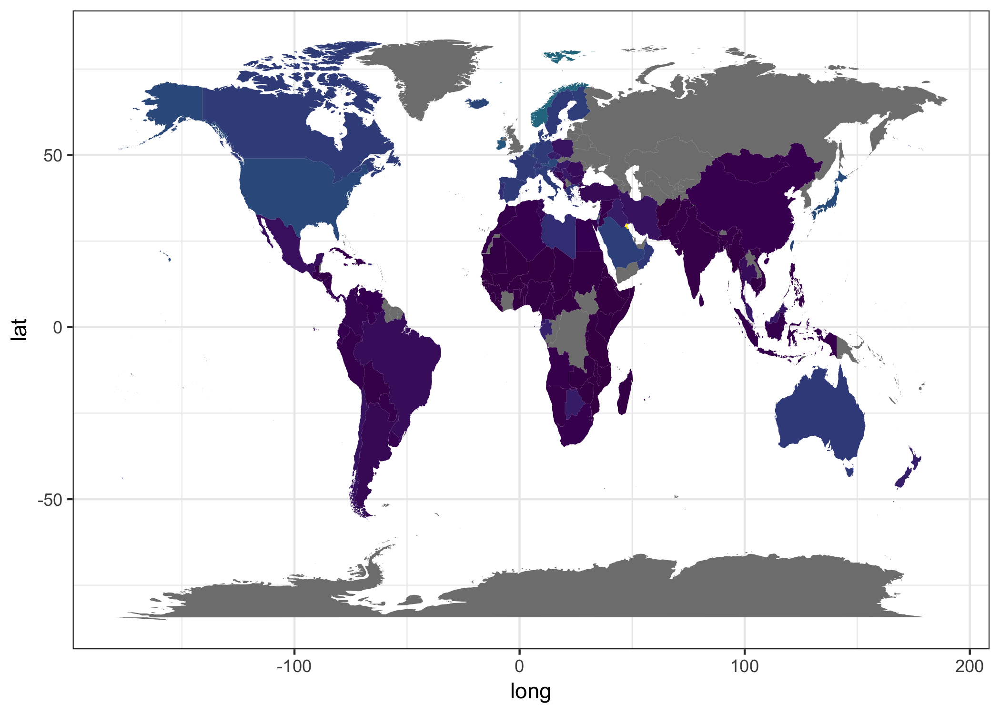

# Factor Management


Loading packages:


```r
suppressPackageStartupMessages(library(tidyverse))
```

```
## Warning: package 'dplyr' was built under R version 3.4.2
```

```r
suppressPackageStartupMessages(library(gapminder))
suppressPackageStartupMessages(library(pander))
library(forcats)
```

**Drop Oceania. Filter the Gapminder data to remove observations associated with the continent of Oceania. Additionally, remove unused factor levels. Provide concrete information on the data before and after removing these rows and Oceania; address the number of rows and the levels of the affected factors.**

First we examine the number of rows and factors of our original dataset:


```r
nrow(gapminder)
```

```
## [1] 1704
```

```r
levels(gapminder$continent)
```

```
## [1] "Africa"   "Americas" "Asia"     "Europe"   "Oceania"
```

We then drop the factor corresponding to Oceania:


```r
noroos <- gapminder %>% 
  filter(continent != "Oceania") %>% 
  droplevels()
```

We can see that our number of rows has dropped by 24. Since gapminder has six entries per country this corresponds to  4 countries in Oceania. We can also see there is no more Oceania factor:


```r
nrow(noroos)
```

```
## [1] 1680
```

```r
levels(noroos$continent)
```

```
## [1] "Africa"   "Americas" "Asia"     "Europe"
```

**Reorder the levels of country or continent. Use the forcats package to change the order of the factor levels, based on a principled summary of one of the quantitative variables. Consider experimenting with a summary statistic beyond the most basic choice of the median.**

In my [first assignment](https://github.com/arsbar24/STAT545-hw-barton-alistair/blob/master/gapminder-exploration.md) one of the things I looked at was countries that improved significantly through the dataset. I found that very few countries had made significant jumps relative to others with regards to GDP (ie. the countries with below average GDP per capita, retain below average GDP per capita even if it increases).

In this assignment I'd like to take a closer look at the countries whose quality of life has drastically increased throughout the dataset, starting with life expectancy (which as I showed in previous assignments increased significantly across the board).

I'm going to use standard deviation as a proxy for improvement, because a) it is a summary statistic, and b) it's robust to outlier years and will favour countries who started the dataset very low for a decade or two before increasing to a level which was maintained for a similar amount of time.

I now arrange the factors in this order and retain only the top six countries (to make the data manageable):


```r
drasticfctr <- fct_reorder(gapminder$country, gapminder$lifeExp, sd, .desc = TRUE) %>%
  levels() %>% 
  head()

drastic<- gapminder %>%
  filter(country %in% drasticfctr) %>% 
  select(year, country, lifeExp)

knitr::kable(head(drastic))
```


 year  country      lifeExp
-----  ----------  --------
 1952  Indonesia     37.468
 1957  Indonesia     39.918
 1962  Indonesia     42.518
 1967  Indonesia     45.964
 1972  Indonesia     49.203
 1977  Indonesia     52.702

Now, the country factor in `drastic` needs to be rearranged (I will also drop unused factors):


```r
drastic$country <- drastic$country %>% 
  droplevels() %>% 
  fct_reorder(drastic$lifeExp, sd, .desc = TRUE)
```

Now let's see what these plots look like:


```r
ggplot(drastic, aes(x = year, y = lifeExp, colour = country
                  )) + facet_wrap(~country) + labs(color = 'country') +
  geom_line()
```

<!-- -->

I was very surprised by these countries, because they are not the all ones that I would think of with regards to drastic improvement in quality of living in the past fifty years, notably they all start at sub-45 life expectancy, so maybe they arise due to a dreadful start to the dataset.

Notice the 'S'-shape of these curves. This is because the standard deviation ranking favours countries that spend few years with moderate life expectancy (their average), spending time at the peak or the bottom of their curves, but it also might be indicative of how life expectancy increases in general (we won't see the same pattern in GDP later), investing in health might have a bit of a snowball effect when your standards are far below the rest of the world, and flatten out as you approach modern standards. Further, even within these countries, the countries with the highest standard deviation amongst this set seem to have the largest changes in life expectancies (Oman has a larger change than Vietnam which has a larger change than Saudi Arabia, etc.).

**Explore the effects of `arrange()`. Does merely arranging the data have any effect on, say, a figure?**

Let's arrange our data by life expectancy:


```r
drastic2 <- arrange(drastic, lifeExp)

head(drastic2)
```

```
## # A tibble: 6 x 3
##    year     country lifeExp
##   <int>      <fctr>   <dbl>
## 1  1952 Yemen, Rep.  32.548
## 2  1957 Yemen, Rep.  33.970
## 3  1962 Yemen, Rep.  35.180
## 4  1967 Yemen, Rep.  36.984
## 5  1952   Indonesia  37.468
## 6  1952        Oman  37.578
```

If we produce the same plot as before (leaving out all the factor managing), we produce the following plot: 

<!-- -->

We can see that it is arranged alphabetically (ie. according to the original factor order of countries in gapminder), rather than any semblance of a life expectancy ordering.

**Explore the effects of reordering a factor and factor reordering coupled with `arrange()`. Especially, what effect does this have on a figure?**

**Experiment with one or more of write_csv()/read_csv() (and/or TSV friends), saveRDS()/readRDS(),  dput()/dget(). Create something new, probably by filtering or grouped-summarization of Singer or Gapminder. I highly recommend you fiddle with the factor levels, i.e. make them non-alphabetical (see previous section). Explore whether this survives the round trip of writing to file then reading back in.**

So now I will move onto analysis of GDP, and find the countries with the biggest standard deviation of GDP per capita in our dataset (I remove Kuwait because its GDP pattern is so uniquely sporadic---an extreme outlier):


```r
nokuwait <- filter(gapminder, country != "Kuwait")

drasticfctr <- fct_reorder(nokuwait$country, nokuwait$gdpPercap, sd, .desc = TRUE) %>%
  levels() %>% 
  head()

drastic<- nokuwait %>%
  filter(country %in% drasticfctr) %>% 
  select(year, country, gdpPercap)

# reorder countries
drastic$country <- drastic$country %>% 
  droplevels() %>% 
  fct_reorder(drastic$gdpPercap, sd, .desc = TRUE)

drastic<-as.data.frame(drastic)
```

I'm excited to work with this, but maybe I'd rather work with it in a separate file, so I'll save it as an rds:


```r
saveRDS(drastic,file = "drastic.rds")
```

Let's remark upon the factors in this file to see if `saveRDS()` preserves them:


```r
levels(drastic$country)
```

```
## [1] "Singapore"        "Norway"           "Hong Kong, China"
## [4] "Ireland"          "Japan"            "United States"
```


**Homework continues [HERE](https://github.com/arsbar24/STAT545-hw-barton-alistair/blob/master/hw05/GDPmap.md), where we'll produce figures like the following:**


