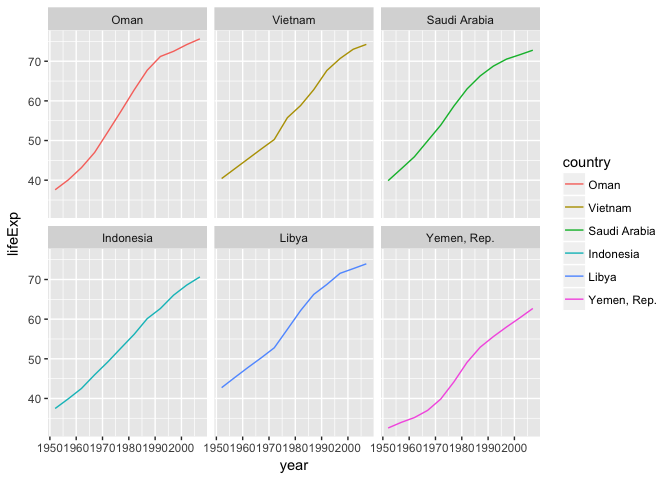

# Factor Management


Loading packages:


```r
suppressPackageStartupMessages(library(tidyverse))
suppressPackageStartupMessages(library(gapminder))
suppressPackageStartupMessages(library(pander))
library(forcats)
```

**Drop Oceania. Filter the Gapminder data to remove observations associated with the continent of Oceania. Additionally, remove unused factor levels. Provide concrete information on the data before and after removing these rows and Oceania; address the number of rows and the levels of the affected factors.**

First we examine the number of rows and factors of our original dataset:

```r
nrow(gapminder)
```

```
## [1] 1704
```

```r
levels(gapminder$continent)
```

```
## [1] "Africa"   "Americas" "Asia"     "Europe"   "Oceania"
```

We then drop the factor corresponding to Oceania:


```r
noroos <- gapminder %>% 
  filter(continent != "Oceania") %>% 
  droplevels()
```

We can see that our number of rows has dropped by 24. Since gapminder has six entries per country this corresponds to  4 countries in Oceania. We can also see there is no more Oceania factor:


```r
nrow(noroos)
```

```
## [1] 1680
```

```r
levels(noroos$continent)
```

```
## [1] "Africa"   "Americas" "Asia"     "Europe"
```

**Reorder the levels of country or continent. Use the forcats package to change the order of the factor levels, based on a principled summary of one of the quantitative variables. Consider experimenting with a summary statistic beyond the most basic choice of the median.**

I'm going to reorder by standard deviation, because why not? It seems reasonable to hypothesize that this will result in giving us countries who have undergone a significant improvement over the years:


```r
drasticfctr <- fct_reorder(gapminder$country, gapminder$lifeExp, sd, .desc = TRUE) %>%
  levels() %>% 
  head()

drastic<- gapminder %>%
  filter(country %in% drasticfctr) %>% 
  select(year, country, lifeExp)

drastic$country <- drastic$country %>% 
  droplevels() %>% 
  fct_reorder(drastic$lifeExp, sd, .desc = TRUE)

ggplot(drastic, aes(x = year, y = lifeExp, colour = country
                  )) + facet_wrap(~country) + labs(color = 'country') +
  geom_line()
```

<!-- -->

Notice the 'S'-shape of these curves. This is because the standard deviation ranking favours countries that spend few years with moderate life expectancy (their average), spending time at the peak or the bottom of their curves. We can also see that the countries with the highest standard deviation amongst this set seem to have the largest changes in life expectancies.

**Explore the effects of `arrange()`. Does merely arranging the data have any effect on, say, a figure?**

Let's arrange our data by life expectancy:


```r
drastic2 <- arrange(drastic, lifeExp)

head(drastic2)
```

```
## # A tibble: 6 x 3
##    year     country lifeExp
##   <int>      <fctr>   <dbl>
## 1  1952 Yemen, Rep.  32.548
## 2  1957 Yemen, Rep.  33.970
## 3  1962 Yemen, Rep.  35.180
## 4  1967 Yemen, Rep.  36.984
## 5  1952   Indonesia  37.468
## 6  1952        Oman  37.578
```

If we produce the same plot as before (leaving out all the factor managing), we produce the following plot: 

<!-- -->

We can see that it is arranged alphabetically (ie. according to the original factor order of countries in gapminder), rather than any semblance of a life expectancy ordering.

**Explore the effects of reordering a factor and factor reordering coupled with `arrange()`. Especially, what effect does this have on a figure?**

**Experiment with one or more of write_csv()/read_csv() (and/or TSV friends), saveRDS()/readRDS(),  dput()/dget(). Create something new, probably by filtering or grouped-summarization of Singer or Gapminder. I highly recommend you fiddle with the factor levels, i.e. make them non-alphabetical (see previous section). Explore whether this survives the round trip of writing to file then reading back in.**


```r
drasticfctr <- fct_reorder(gapminder$country, gapminder$gdpPercap, sd, .desc = TRUE) %>%
  levels() %>% 
  head()

drastic<- gapminder %>%
  filter(country %in% drasticfctr, country != "Kuwait") %>% 
  select(year, country, gdpPercap)

drastic$country <- drastic$country %>% 
  droplevels() %>% 
  fct_reorder(drastic$gdpPercap, sd, .desc = TRUE)

drastic<-as.data.frame(drastic)

saveRDS(drastic,file = "drastic.rds")
#write_csv(drastic, "drastic.csv")
```

