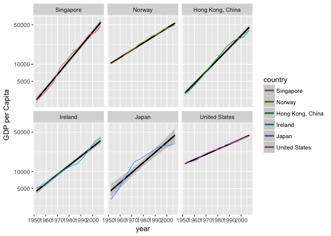

# Read File


```r
suppressPackageStartupMessages(library(tidyverse))
suppressPackageStartupMessages(library(gapminder))
suppressPackageStartupMessages(library(pander))
library(forcats)
```

Welcome back! First things first, we'll read our rds file, saved in the previous step, notice that the factor order is indeed preserved!


```r
rm(drastic)
```

```
## Warning in rm(drastic): object 'drastic' not found
```

```r
drastic <- readRDS("drastic.rds")
levels(drastic$country)
```

```
## [1] "Singapore"        "Norway"           "Hong Kong, China"
## [4] "Ireland"          "Japan"            "United States"
```

So that's nice, let us now plot their GDP per capita over time (we'll use a log y axis, since the growth appears to be mostly exponential):


```r
niceplot <- ggplot(drastic, aes(x = year, y = gdpPercap, colour = country)) + facet_wrap(~country) + labs(color = 'country') + geom_smooth(color = 'black', method = "gam", show.legend = T) +
  geom_line() + scale_y_log10("GDP per Capita", breaks = c(5000, 10000, 50000), labels = c(5000, 10000, 50000))

niceplot
```

<!-- -->

These countries are much more the poster-boys for improvement in quality of life in the western world. Maybe this is indicative of GDP being the ultimate decider of whether a country is considered developed or not. Notice that the log scale distorts some of the improvement: it is not apparent from the graph alone that Norway has a larger standard deviation than Hong Kong.


```r
ggsave("gdpDrastic.pdf")
```

```
## Saving 7 x 5 in image
```
