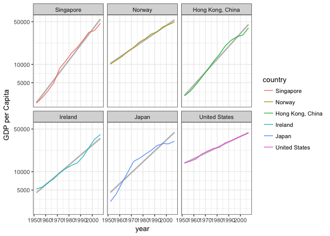
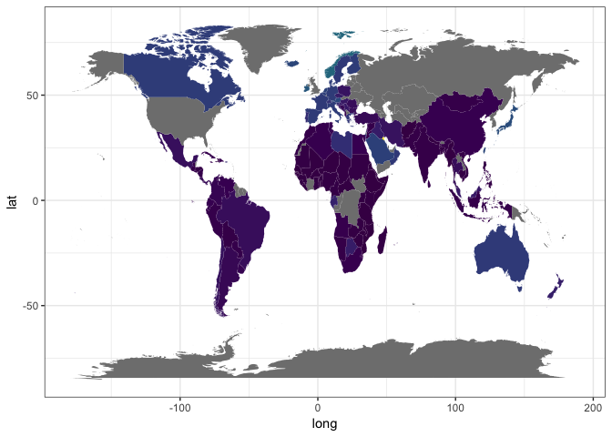

# Read File


```r
suppressPackageStartupMessages(library(tidyverse))
```

```
## Warning: package 'dplyr' was built under R version 3.4.2
```

```r
suppressPackageStartupMessages(library(gapminder))
suppressPackageStartupMessages(library(pander))
library(forcats)
library(maps)
```

```
## 
## Attaching package: 'maps'
```

```
## The following object is masked from 'package:purrr':
## 
##     map
```

```r
library(mapdata)
suppressPackageStartupMessages(library(viridis))
```

Welcome back! First things first, we'll read our rds file, saved in the previous step, notice that the factor order is indeed preserved!


```r
rm(drastic)
```

```
## Warning in rm(drastic): object 'drastic' not found
```

```r
drastic <- readRDS("drastic.rds")
levels(drastic$country)
```

```
## [1] "Singapore"        "Norway"           "Hong Kong, China"
## [4] "Ireland"          "Japan"            "United States"
```

So that's nice, let us now plot their GDP per capita over time (we'll use a log y axis, since the growth appears to be mostly exponential):


```r
ggplot(drastic, aes(x = year, y = gdpPercap, colour = country)) + 
  facet_wrap(~country) + labs(color = 'country') + 
  geom_smooth(color = 'grey', method = "gam", se = F) +
  geom_line() + 
  scale_y_log10("GDP per Capita", breaks = c(5000, 10000, 50000), labels = c(5000, 10000, 50000)) +
  theme_bw()
```

<!-- -->

These countries are much more the poster-boys for improvement in quality of life in the western world. Maybe this is indicative of GDP being the ultimate decider of whether a country is considered developed or not. Most countries seem to follow an almost exponential growth, with the notable exception of Japan. 

Notice that the log scale distorts some of the improvement: it is not apparent from the graph alone that Norway has a larger standard deviation than Hong Kong. To remedy this I want to plot the wealth over time of each of these countries, by use of a bar chart:


```r
ggplot(drastic, aes(x = year)) + 
  geom_bar(aes(weight = gdpPercap, fill = country), position = 'stack') +
  labs(y = 'GDP per capita') +
  theme_bw()
```

<!-- -->

To conclude this class, I'd like to fulfill one of my dreams of making my own map-based data-visualization (I'm a bit of a map nerd). To do this I use the map packages I installed at the beginning, and make use of the `left_join()` function to concatenate the data from gapminder:


```r
# map data
world <- map_data("world")
world <- world %>% 
  mutate(country = region) %>%  # relabel stuff to make consistent
  select(-region)

# gapminder data
today <- gapminder %>% 
  group_by(country) %>% 
  summarize(sd(gdpPercap)) %>% 
  mutate(wealthChange = `sd(gdpPercap)`) %>% 
  select(-`sd(gdpPercap)`)

worldgap <- left_join(world, today)
```

```
## Joining, by = "country"
```

```
## Warning: Column `country` joining character vector and factor, coercing
## into character vector
```


```r
ggplot(data = worldgap) + 
  geom_polygon(aes(x = long, y = lat, fill = wealthChange, group = group)) +
  scale_fill_viridis() +
  guides(fill=FALSE) +
  theme_bw()
```

<!-- -->

Unfortunately there's a problem as some of the countries have different names in the gapminder and maps datasets (notably Russia, USA, Congo). To show how to remedy this, I will relabel the USA factor: 


```r
gapUSA <- gapminder

levels(gapUSA$country)[levels(gapUSA$country)=="United States"] <- "USA" # relabel the United States factor
```

Now joining the data and reproducing the above figure, yields the following:


```
## Joining, by = "country"
```

```
## Warning: Column `country` joining character vector and factor, coercing
## into character vector
```

```r
ggplot(data = worldgap) + 
  geom_polygon(aes(x = long, y = lat, fill = wealthChange, group = group)) +
  scale_fill_viridis() +
  guides(fill=FALSE) +
  theme_bw()
```

<!-- -->

Filling in the USA now.

Now here I'm going to save this figure so that I can show it in the [main Assignment 5 file](https://github.com/arsbar24/STAT545-hw-barton-alistair/blob/master/hw05/Assignment_5.md) because I'm very proud of it:


```r
ggsave("map.png")
```

```
## Saving 7 x 5 in image
```
