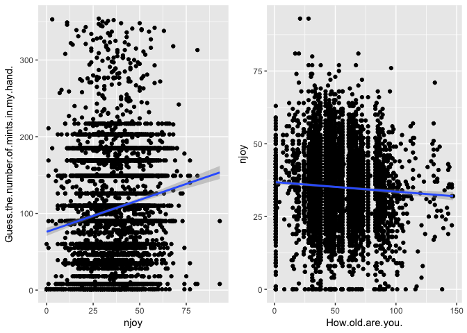

# 3. Work with the candy data

```r
knitr::opts_chunk$set(echo = TRUE)
options(knitr.table.format = 'markdown')
```


```r
suppressPackageStartupMessages(library(tidyverse))
```

```
## Warning: package 'dplyr' was built under R version 3.4.2
```

```r
suppressPackageStartupMessages(library(gridExtra))
```


I chose this project since I haven't had to do some data-wrangling for a while, so I think it'd be good to get some practice in. I begin with reading in the file


```r
candy <- read.csv("CANDY.csv", header=TRUE, 
  	sep=",")
```

Let us first check the size of this data:


```r
dim(candy)
```

```
## [1] 5630  124
```

This is a huge file! Let's narrow it down to an abridged version, so it's easier to analyze:


```r
abcandy <- candy[c(1:96,100)]
```

I chose which columns to keep manually. The data now includes the ages, whether or not they're going trick-or-treating, their preference on a range of candies and their guess for how many mints are in the persons hand. I'm going to try to analyze **how good of a predictor their guess of how many mints of is for a) age and b) how much candy someone likes** (maybe people who like candy are more hopeful with their guesses?).

First, I'll write a fucntion that counts the number of JOYs in each row and adds that as a variable (while removing all the particular preferences). This will be our measure for how much someone likes candy.


```r
countjoy <- function(data, cols = c(1:ncol(data))){
  njoy <- c()
  for(i in 1:nrow(data)){
    datai <- data[i,cols]
    njoy[i] <- sum(datai == "JOY")
  }
  data %>% 
    mutate(njoy) %>% 
    select(c(1,2,3,ncol(data),ncol(data)+1))
}
```

We now apply this function to our dataset:


```r
joycandy <- countjoy(abcandy)

knitr::kable(head(joycandy))
```


|Timestamp          |How.old.are.you. |Are.you.going.actually.going.trick.or.treating.yourself. |Guess.the.number.of.mints.in.my.hand. | njoy|
|:------------------|:----------------|:--------------------------------------------------------|:-------------------------------------|----:|
|10-23-2015 8:46:20 |35               |No                                                       |2                                     |   14|
|10-23-2015 8:46:52 |41               |No                                                       |10                                    |   32|
|10-23-2015 8:47:34 |33               |No                                                       |4                                     |   36|
|10-23-2015 8:47:59 |31               |No                                                       |5                                     |   42|
|10-23-2015 8:48:12 |30               |No                                                       |0                                     |   14|
|10-23-2015 8:49:07 |38               |No                                                       |2                                     |   64|

Before we plot, we need to ensure that all our variables are quantitative by removing non-numeric arguments and replacing them with NA:


```r
nonacandy <- data.frame(mapply(as.numeric,joycandy))
```

We now plot the resulting graphs


```r
p1 <- ggplot(nonacandy,aes(x=njoy, y = Guess.the.number.of.mints.in.my.hand.))+geom_point() + geom_smooth(method = 'lm')
p2 <- ggplot(nonacandy,aes(x=How.old.are.you., y = njoy))+geom_point() + geom_smooth(method = 'lm')

grid.arrange(p1, p2, ncol=2)
```

<!-- -->

We can see a very minor trend that nevertheless appears to be statistically significant for both graphs in the direction we predicted (younger people like more candies, and people who like candy guessed that the person was holding more mints). To find out precisely how strong the correlation is, we use the `lm()` function:


```r
lm(njoy~How.old.are.you., nonacandy)
```

```
## 
## Call:
## lm(formula = njoy ~ How.old.are.you., data = nonacandy)
## 
## Coefficients:
##      (Intercept)  How.old.are.you.  
##         36.83192          -0.03276
```

```r
lm(Guess.the.number.of.mints.in.my.hand.~njoy, nonacandy)
```

```
## 
## Call:
## lm(formula = Guess.the.number.of.mints.in.my.hand. ~ njoy, data = nonacandy)
## 
## Coefficients:
## (Intercept)         njoy  
##     75.9948       0.8322
```

Thus we can see that on average every 30 years older someone is, they will likely like one less candy. On the other hand for each candy brand someone likes, the number of mints that they guess the person is holding increases by one--a much stronger correlation than I anticipated.
