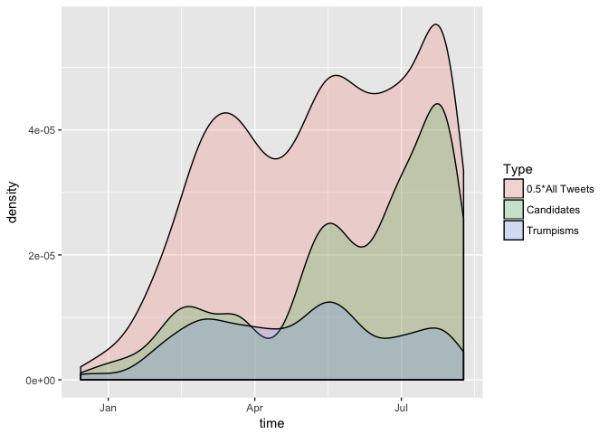

# Trump Tweets


Load `purrr` and Trumps tweets:


```r
library(purrr)
```

```
## Warning: package 'purrr' was built under R version 3.4.2
```

```r
suppressMessages(library(dplyr))
```

```
## Warning: package 'dplyr' was built under R version 3.4.2
```

```r
library(tibble)
suppressPackageStartupMessages(library(tidyverse))


load(url("http://varianceexplained.org/files/trump_tweets_df.rda"))
```

We store the text of the tweets and their time for analysis:


```r
tweets <- trump_tweets_df$text
time <- trump_tweets_df$created
```

We now build a 'regular expression'. This is the collection of words we will parse Trump's tweets for:


```r
OtherCand <- "Hillary|Bernie|Ted Cruz|Ben Carson|Bush"
Trumpisms <- "huge|wall|crooked|best|believe|win|lose|make america|sad"
```

In the tutorial they scale down the problem to improve the running time and simplicity of analysis when playing around with it. I did that to play around with this stuff, but then scaled up to the full data when I was done.


```r
matches <- gregexpr(OtherCand, tweets)
matches2 <- gregexpr(Trumpisms, tweets)

head(matches)
```

```
## [[1]]
## [1] -1
## attr(,"match.length")
## [1] -1
## 
## [[2]]
## [1] -1
## attr(,"match.length")
## [1] -1
## 
## [[3]]
## [1] -1
## attr(,"match.length")
## [1] -1
## 
## [[4]]
## [1] -1
## attr(,"match.length")
## [1] -1
## 
## [[5]]
## [1] -1
## attr(,"match.length")
## [1] -1
## 
## [[6]]
## [1] -1
## attr(,"match.length")
## [1] -1
```

The stucture here indicates where there were matches of words in our regular expression. Each `[[#]]` indicates a index of our data (e.g. `[[1]]` is the first tweet in the data). The first number following that is the character location of our match while the second set of numbers (the 'attribute') is the length of the matching string of text (e.g. Trump's 5th tweet has a match starting at its 20th character of length 5). `-1` indicates that a tweet has no matching string of characters.

There's a lot more analysis of how to find which words are caught in which tweet in the tutorial, but I'll skip that here, to get to the juicy stuff: I want to plot the frequency of Trump's usage of these words.

To count the number of times one of our words appears in each tweet, we must be careful to avoid counting the `-1`s (this is what applying `length` would do). This may be done as follows:


```r
nummatch <- map(matches, ~ sum(.x > 0))
nummatch2 <- map(matches2, ~ sum(.x > 0))
head(nummatch)
```

```
## [[1]]
## [1] 0
## 
## [[2]]
## [1] 0
## 
## [[3]]
## [1] 0
## 
## [[4]]
## [1] 0
## 
## [[5]]
## [1] 0
## 
## [[6]]
## [1] 0
```

Now we create a dataframe out of this data:


```r
nummatch <- as.numeric(nummatch)
nummatch2 <- as.numeric(nummatch2)
all <- rep(0.5,length(nummatch)) # counts every tweet once

df <- data.frame(time, nummatch, nummatch2, all)
knitr::kable(head(df))
```


time                   nummatch   nummatch2   all
--------------------  ---------  ----------  ----
2016-08-08 15:20:44           0           0   0.5
2016-08-08 13:28:20           0           0   0.5
2016-08-08 00:05:54           0           0   0.5
2016-08-07 23:09:08           0           0   0.5
2016-08-07 21:31:46           0           0   0.5
2016-08-07 13:49:29           0           0   0.5

Now we want to plot these on the same graph, so its natural to reshape our data so that `nummatch` is a type of count


```r
df2 <- gather(df, wordtype, count, nummatch:nummatch2:all)
```

```
## Warning in x:y: numerical expression has 2 elements: only the first used
```

```r
knitr::kable(head(df2))
```


time                  wordtype    count
--------------------  ---------  ------
2016-08-08 15:20:44   nummatch        0
2016-08-08 13:28:20   nummatch        0
2016-08-08 00:05:54   nummatch        0
2016-08-07 23:09:08   nummatch        0
2016-08-07 21:31:46   nummatch        0
2016-08-07 13:49:29   nummatch        0

Now we can plot it:


```r
ggplot(df2, aes(x=time, fill = wordtype)) + 
  geom_density(aes(weights = count), alpha = 0.2) +
  scale_fill_discrete(name = "Type", labels=c("All Tweets", "Candidates","Trumpisms"))
```

```
## Warning: Ignoring unknown aesthetics: weights
```

```
## Warning in density.default(x, weights = w, bw = bw, adjust = adjust, kernel
## = kernel, : sum(weights) != 1 -- will not get true density

## Warning in density.default(x, weights = w, bw = bw, adjust = adjust, kernel
## = kernel, : sum(weights) != 1 -- will not get true density

## Warning in density.default(x, weights = w, bw = bw, adjust = adjust, kernel
## = kernel, : sum(weights) != 1 -- will not get true density
```

<!-- -->


