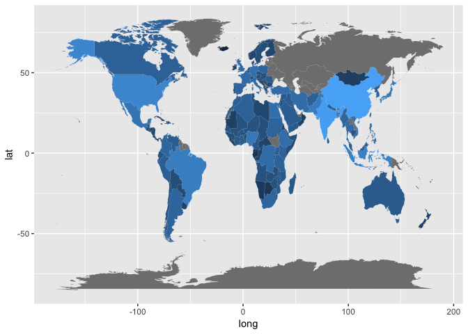

# 2. Writing Functions: Maps

```r
knitr::opts_chunk$set(echo = TRUE)
options(knitr.table.format = 'markdown')
```

Loading packages:


```r
suppressPackageStartupMessages(library(tidyverse))
```

```
## Warning: package 'purrr' was built under R version 3.4.2
```

```
## Warning: package 'dplyr' was built under R version 3.4.2
```

```r
library(gapminder)
library(pander)
library(forcats)
suppressPackageStartupMessages(library(maps))
library(mapdata)
```

## 2. Writing functions
>Write one (or more) functions that do something useful to pieces of the Gapminder or Singer data. It is logical to think about computing on the mini-data frames corresponding to the data for each specific country, location, year, band, album, … This would pair well with the prompt below about working with a nested data frame, as you could apply your function there.


In my last assignment for 545 I created a map of the world with countries coloured corresponding to a quantitative variable. This was a fun thing to do, but I'd like to make it easier to do in the future, so I'm going to write a function that takes in some collection of gapminder data (one entry per country) and outputs a dataset that's ready to be made into a map. 

The map data is essentially a bunch of coordinates detailing where the edge of each country lies. We can then use `geom_polygon` to draw these on a graph, and use the `fill` option to colour them according to any variable we choose.

To combine gapminder data with map data it suffices to use a simple `left_join()`; however there are a couple technicalities that must be tackled first. For one, the map dataset labels its countries as "regions", so we must relabel this column as it is the joining variable. On a similar note, many of the gapminder countries are not named the same in the map datasets (e.g. "USA" vs. "United States"), so we will relabel some of them (this is the most tedious thing that I'd like to do once and for all). There are also many countries in the map data not represented in gapminder, but we will ignore this.

Let us first identify the mislabeled countries:


```r
map <- map_data("world") %>% 
    mutate(country = as.factor(region)) %>%  # factorize country for our map
    select(-region)

gapcountries <- summarize(group_by(gapminder,country),mean(pop))

knitr::kable(anti_join(gapcountries, map))
```

```
## Joining, by = "country"
```

```
## Warning: Column `country` joining factors with different levels, coercing
## to character vector
```


|country             | mean(pop)|
|:-------------------|---------:|
|Congo, Dem. Rep.    |  32681655|
|Congo, Rep.         |   1923209|
|Cote d'Ivoire       |   9153110|
|Hong Kong, China    |   4792259|
|Korea, Dem. Rep.    |  16453881|
|Korea, Rep.         |  36499386|
|Slovak Republic     |   4774507|
|Trinidad and Tobago |   1006470|
|United Kingdom      |  56087801|
|United States       | 228211232|
|West Bank and Gaza  |   1848606|
|Yemen, Rep.         |  10843192|

Notably, there is no Russia in gapminder. We can identify the matching country in our map data by listing all its levels:


```r
knitr::kable(head(levels(map$country)))
```

```
## Warning in kable_markdown(x = structure(c("Afghanistan", "Albania",
## "Algeria", : The table should have a header (column names)
```


|               |
|:--------------|
|Afghanistan    |
|Albania        |
|Algeria        |
|American Samoa |
|Andorra        |
|Angola         |

Doing this, we find the mismatch to be countries labelled ("Congo, Dem. Rep.", "Congo, Rep.", "Cote d'Ivoire", "Korea, Dem. Rep.", "Korea, Rep.", "Slovak Republic", "Trinidad and Tobago", "United Kingdom", "United States", "West Bank and Gaza", "Yemen, Rep.") in gapminder and countries labelled ("Democratic Republic of the Congo", "Republic of Congo", "Ivory Coast", "North Korea", "South Korea", "Slovakia", "Trinidad", "UK", "USA", "Palestine", "Yemen") in the map data. Hong Kong is thus the only country in gapminder that isn't in the map data.

Now that we have this information we are ready to write our function. We may also like our function to output a plot, so I add an argument that will create a map of the world if it is set to `TRUE`, and will default to filling in countries according to the last column in the input data:


```r
gapmap <- function(data, plot = TRUE, fillvar = colnames(data)[ncol(data)]) {
  if("country" %in% colnames(data) == FALSE) {
    stop('data must be dataframe with a country column')
  }
  if(is.logical(plot) == FALSE) {
    stop('plot variable must be logical')
  }
  # relabel region column
  map <- map_data("world") %>% 
    mutate(country = as.factor(region)) %>%  # factorize country for our map
    select(-region)
  
  # relabel countries to match gapminder
  gapcountry <- c("Congo, Dem. Rep.", "Congo, Rep.", "Cote d'Ivoire", "Korea, Dem. Rep.", "Korea, Rep.", "Slovak Republic", "Trinidad and Tobago", "United Kingdom", "United States", "West Bank and Gaza", "Yemen, Rep.")
  mapcountry <- c("Democratic Republic of the Congo", "Republic of Congo", "Ivory Coast", "North Korea", "South Korea", "Slovakia", "Trinidad", "UK", "USA", "Palestine", "Yemen")
  for(i in 1:length(gapcountry)){
    levels(map$country)[levels(map$country)==mapcountry[i]] <- gapcountry[i]
  }
  
  # combine data
  mapdata <- left_join(map, data, by = "country")
  
  # plot
  if(plot == TRUE) {
    return(ggplot(data = mapdata) + 
  geom_polygon(aes(x = long, y = lat, fill = mapdata[[fillvar]], group = group)) +
  guides(fill=FALSE))
  }
  
  else{
    return(mapdata)
  }
}
```

where we use a for loop to simplify our relabelling process (I tried vectorizing it but R took it to mean something different).

We now show an example of how to use it to colour countries by their most recent population:


```r
countrypop <- gapminder %>% 
  group_by(country) %>% 
  summarize(logpop = log(pop[length(pop)]))

knitr::kable(head(countrypop))
```


|country     |   logpop|
|:-----------|--------:|
|Afghanistan | 17.27780|
|Albania     | 15.09659|
|Algeria     | 17.32206|
|Angola      | 16.33486|
|Argentina   | 17.51191|
|Australia   | 16.83272|

```r
gapmap(countrypop, TRUE)
```

```
## Warning: Column `country` joining factors with different levels, coercing
## to character vector
```

<!-- -->

Here, we can see that most of the regions with no data in gapminder are in the former soviet union.


