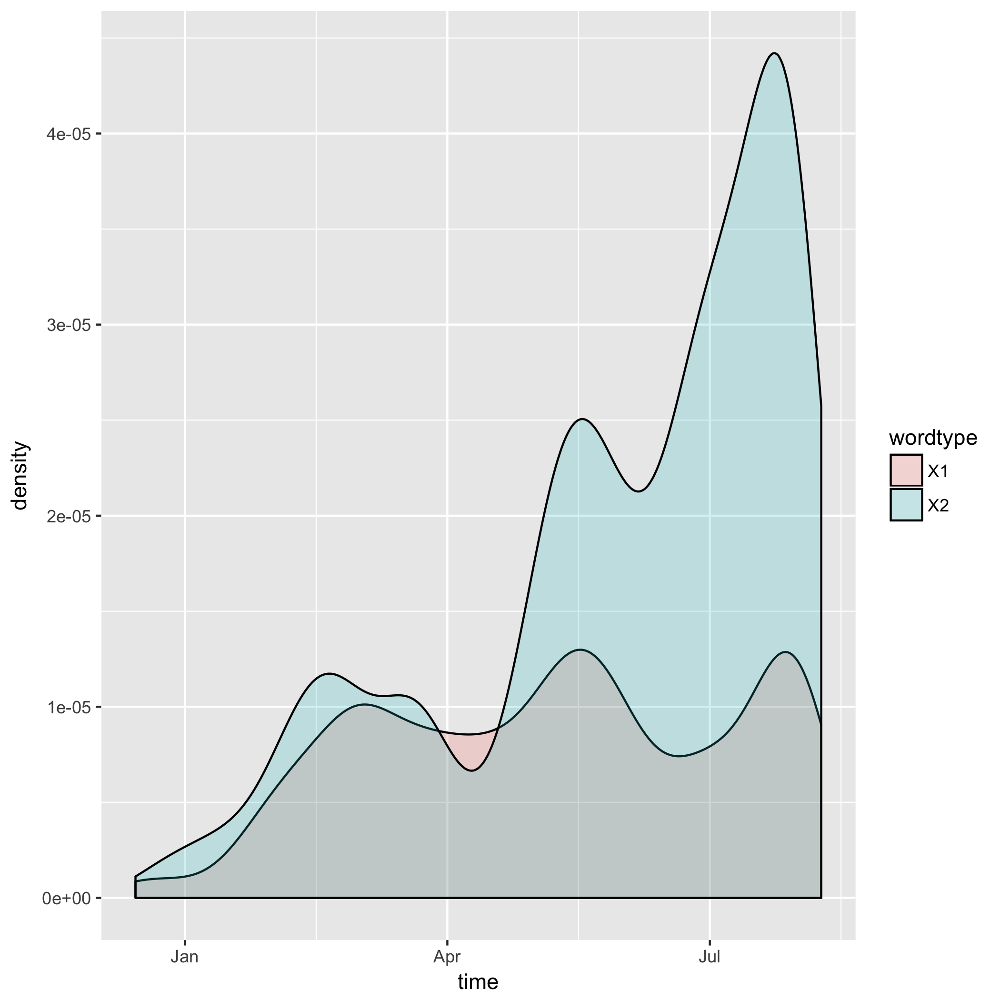

```{r setup, include=TRUE}
knitr::opts_chunk$set(echo = TRUE)
options(knitr.table.format = 'markdown')
```

In this assignment, I search a collection of Donald Trumps tweets for the following sets of words:

```{r}
Words <- read.delim("SummaryFiles/Words.tsv")
knitr::kable(Words)
```

and then plot his usage of them over time.

Note that this entire assignment is easily scalable. All one needs to do is add another regular expression to the vector `Trumpisms` and add a name for it to the vector `wordtypes` in [01_dataframe.R](https://github.com/arsbar24/STAT545-hw-barton-alistair/blob/master/hw07/MakeFiles/01_dataframe.R) and the analysis will automatically include it next time you run it. To somewhat demonstrate this, I do my analysis on three sets of words when originally it was just two (as I did on my last assignment)

We begin by downloading the data in [`00_download.R`](https://github.com/arsbar24/STAT545-hw-barton-alistair/blob/master/hw07/MakeFiles/00_download.R) (the [info](https://jennybc.github.io/purrr-tutorial/ls08_trump-tweets.html) for doing this was obtained from the previous assignment). 

We then count the occurences of the words in each tweet in [`01_dataframe.R`](https://github.com/arsbar24/STAT545-hw-barton-alistair/blob/master/hw07/MakeFiles/01_dataframe.R) using the following function:

```
match <- function(words, tweets = tweets){
  matches <- gregexpr(words,tweets)
  nummatches <- map(matches, ~ sum(.x > 0))
  as.numeric(nummatches)
}
```

which I apply to all the sets of words at once using `lapply()`. I then arrange these counts in a dataframe, using the following `gather()` to put the counts for each set in the same column

```
df2 <- df %>% 
  gather(wordtype, count, colnames(df)[2]:colnames(df)[ncol(df)])
```

I then save this data along with the words in the `Words.tsv` file so we can input it at the top of this page if we change them. We also count the total number of occurences and save in `Occ.tsv` (both these data files are located in the [SummaryFiles](https://github.com/arsbar24/STAT545-hw-barton-alistair/blob/master/hw07/SummaryFiles/) folder).


In [`02_plot.R`](https://github.com/arsbar24/STAT545-hw-barton-alistair/blob/master/hw07/MakeFiles/02_plot.R) we make a density plot of Trump's usage of these words over time (which we encountered some difficulty with detailed in the README file), using the following code

```
df$time <- as.POSIXct(df$time)
df$count <- as.double(df$count)

p <- ggplot(df, aes(x=time, fill = wordtype)) + 
  geom_density(aes(weight = count), alpha = 0.2)
```

The plot is also [located](https://github.com/arsbar24/STAT545-hw-barton-alistair/blob/master/hw07/SummaryFiles/tweet_freq.png) in SummaryFiles. 


We automate this all in [`Makefile`](https://github.com/arsbar24/STAT545-hw-barton-alistair/blob/master/hw07/Makefile) for easy running. `Makefile` also deletes intermediate files created along the way and moves files appearing in this summary to [SummaryFiles](https://github.com/arsbar24/STAT545-hw-barton-alistair/blob/master/hw07/SummaryFiles/). It also automates the [Rmd file](https://github.com/arsbar24/STAT545-hw-barton-alistair/blob/master/hw07/Summary.Rmd) that generates this page.

The final product of this is the following plot:



We can see Trump referred to his opponents about as frequently as he used his catchphrases at the beginning of his campaign, but that he referred to his fellow candidates more and more as the campaign drew on. I suspect the uptrend at the end of the data continues, but the smoothing function I use doesn't see any data after the end of the dataset so trends down. I was a bit surprised at his relative lack of his catchphrases, given how much they stick out.

Lastly, we can also see the total amount of counts of each variable from the `Occ.tsv` file I created:

```{r}
knitr::kable(read.delim("SummaryFiles/Occ.tsv"))
```


