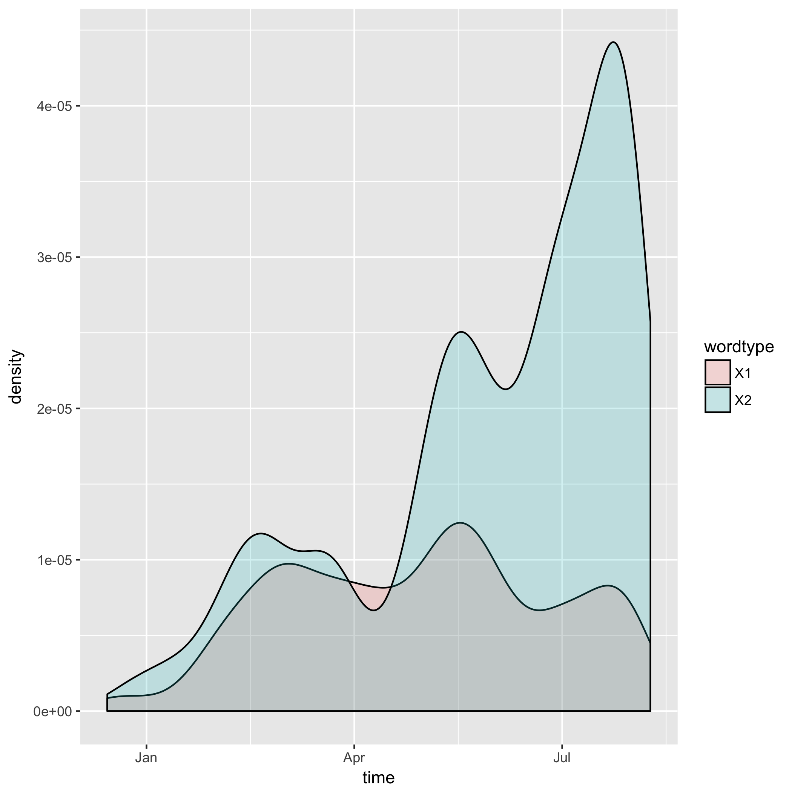

```{r setup, include=TRUE}
knitr::opts_chunk$set(echo = TRUE)
options(knitr.table.format = 'markdown')
```

```{r}
library(stringr)
library(purrr)
suppressMessages(library(dplyr))
library(tibble)
suppressPackageStartupMessages(library(tidyverse))
```

In this assignment, I search a collection of Donald Trumps tweets for the following sets of words:

```{r}
Words <- read.delim("Words.tsv")
knitr::kable(Words)
```

and then plot his usage of them over time.

We begin by downloading the data in [`00_download.R`](https://github.com/arsbar24/STAT545-hw-barton-alistair/blob/master/hw07/00_download.R) (the [info](https://jennybc.github.io/purrr-tutorial/ls08_trump-tweets.html) for doing this was obtained from the previous assignment). We then count the occurences of the words in each tweet in [`01_dataframe.R`](https://github.com/arsbar24/STAT545-hw-barton-alistair/blob/master/hw07/01_dataframe.R) and arrange this data in a dataframe, using `gather()` so that it's ripe for plotting--we also save our the words in the `Words.csv` file so we can input it at the top of this page if we change them. In [`02_plot.R`](https://github.com/arsbar24/STAT545-hw-barton-alistair/blob/master/hw07/02_plot.R) we make a density plot of Trump's usage of these words over time (which we encountered some difficulty with detailed in the README file). And we automate this all in [`Makefile`](https://github.com/arsbar24/STAT545-hw-barton-alistair/blob/master/hw07/Makefile) for easy running (which deletes intermediate files), this file also automates the [Rmd file](https://github.com/arsbar24/STAT545-hw-barton-alistair/blob/master/hw07/Summary.Rmd) that generates this page.

The final product of this is the following plot:



We can also see the total amount of counts of each variable from the `Occ.csv` file I created:
```{r}
knitr::kable(read.delim("Occ.csv"))
```


