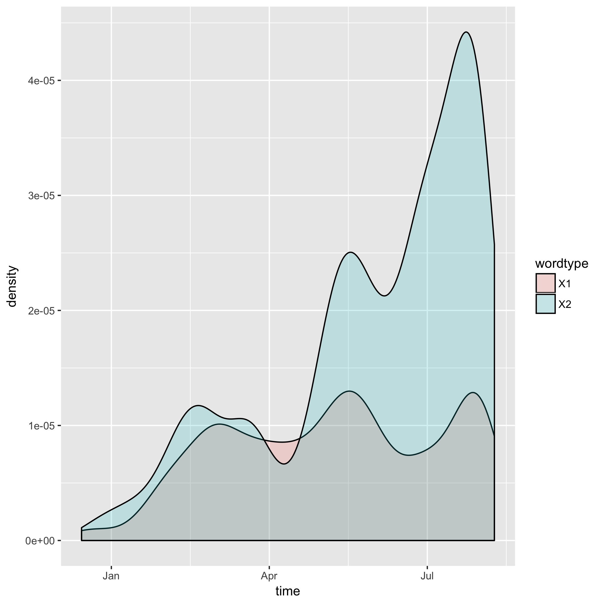

```{r setup, include=TRUE}
knitr::opts_chunk$set(echo = TRUE)
options(knitr.table.format = 'markdown')
```

```{r}
library(stringr)
library(purrr)
suppressMessages(library(dplyr))
library(tibble)
suppressPackageStartupMessages(library(tidyverse))
```

In this assignment, I search a collection of Donald Trumps tweets for the following sets of words:

```{r}
Words <- read.delim("Words.csv")
as.character(Words$x)
```

and then plot his usage of them over time.

We begin by downloading  in `00_download.R` (the info for doing this was obtained from the previous assignment). We then count the occurences of the words in each tweet in `01_dataframe.R` and arrange this data in a dataframe, using `gather()` so that it's ripe for plotting. In `02_plot.R` we make a density plot of Trump's usage of these words over time (which we encountered some difficulty with detailed in the README file). And we automate this all in `Makefile` for easy running (which also deletes intermediate files).

The final product of this is the following plot:




