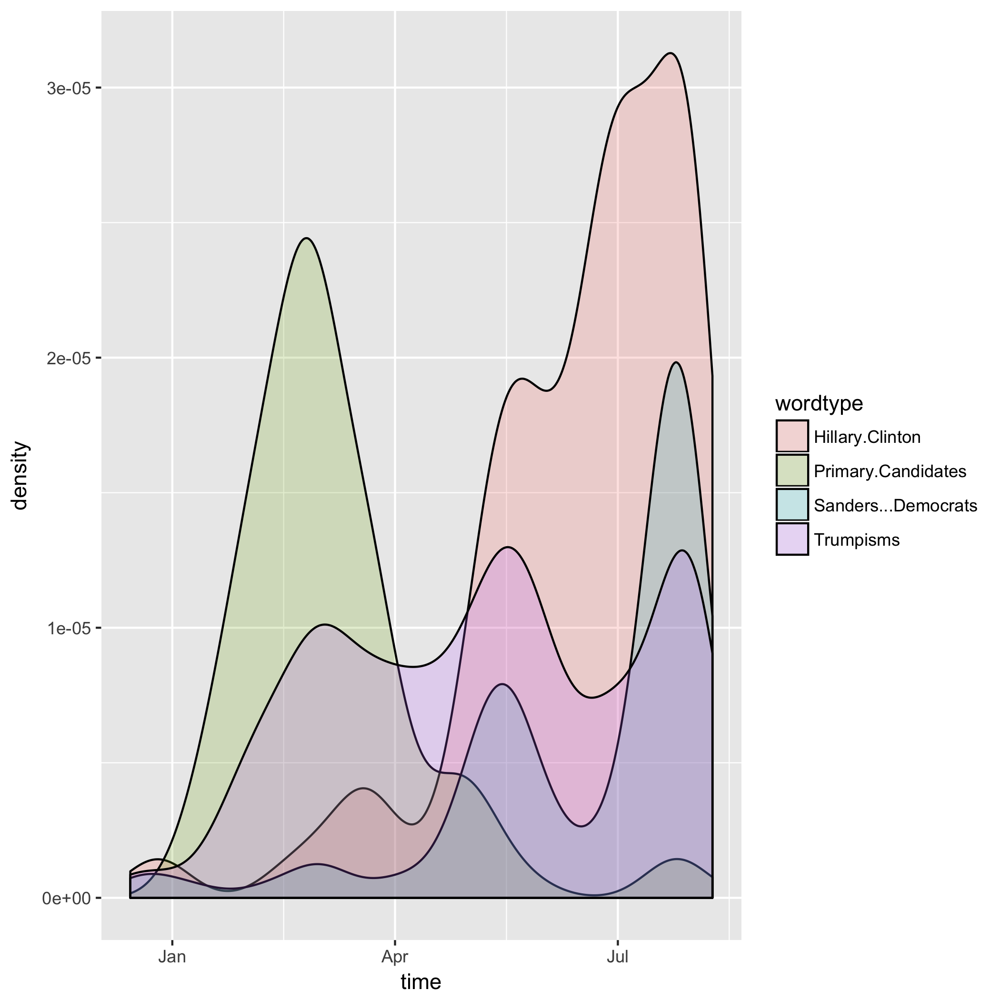

# Summary


```r
knitr::opts_chunk$set(echo = TRUE)
options(knitr.table.format = 'markdown')
```

In this assignment, I search a collection of Donald Trumps tweets for the following sets of words:


```r
Words <- read.delim("SummaryFiles/Words.tsv")
knitr::kable(Words)
```


|wordtype         |Words                                                                                                               |
|:----------------|:-------------------------------------------------------------------------------------------------------------------|
|Trumpisms        |huge&#124;wall&#124;crooked&#124;best&#124;believe&#124;win&#124;lose&#124;great again&#124;MAGA&#124;sad&#124;best |
|Other candidates |Hillary&#124;Bernie&#124;Ted Cruz&#124;Ben Carson&#124;Bush                                                         |
|Places           |China&#124;Mexico&#124;Canada&#124;America&#124;Europe                                                              |

and then plot his usage of them over time.

Note that this entire assignment is easily scalable. All one needs to do is add another regular expression to the vector `Trumpisms` and add a name for it to the vector `wordtypes` in [01_dataframe.R](https://github.com/arsbar24/STAT545-hw-barton-alistair/blob/master/hw07/MakeFiles/01_dataframe.R) and the analysis will automatically include it next time you run it.

We begin by downloading the data in [`00_download.R`](https://github.com/arsbar24/STAT545-hw-barton-alistair/blob/master/hw07/MakeFiles/00_download.R) (the [info](https://jennybc.github.io/purrr-tutorial/ls08_trump-tweets.html) for doing this was obtained from the previous assignment). 

We then count the occurences of the words in each tweet in [`01_dataframe.R`](https://github.com/arsbar24/STAT545-hw-barton-alistair/blob/master/hw07/MakeFiles/01_dataframe.R) and arrange this data in a dataframe, using `gather()` so that it's ripe for plotting--we also save our the words in the `Words.tsv` file so we can input it at the top of this page if we change them. We also count the total number of occurences and save in `Occ.tsv` (both these data files are located in the [SummaryFiles](https://github.com/arsbar24/STAT545-hw-barton-alistair/blob/master/hw07/SummaryFiles/) folder).

In [`02_plot.R`](https://github.com/arsbar24/STAT545-hw-barton-alistair/blob/master/hw07/MakeFiles/02_plot.R) we make a density plot of Trump's usage of these words over time (which we encountered some difficulty with detailed in the README file), which is also [located](https://github.com/arsbar24/STAT545-hw-barton-alistair/blob/master/hw07/SummaryFiles/tweet_freq.png) in SummaryFiles. 

We automate this all in [`Makefile`](https://github.com/arsbar24/STAT545-hw-barton-alistair/blob/master/hw07/Makefile) for easy running (which deletes intermediate files and moves files appearing in this summary to [SummaryFiles](https://github.com/arsbar24/STAT545-hw-barton-alistair/blob/master/hw07/SummaryFiles/)), this file also automates the [Rmd file](https://github.com/arsbar24/STAT545-hw-barton-alistair/blob/master/hw07/Summary.Rmd) that generates this page.

The final product of this is the following plot:



We can see he referred to his opponents about as frequently as he used his catchphrases at the beginning of his campaign, but that he referred to his fellow candidates more and more as the campaign drew on. I suspect the uptrend at the end of the data continues, but the smoothing function I use doesn't see any data after the end of the dataset so trends down.

We can also see the total amount of counts of each variable from the `Occ.csv` file I created:

```r
knitr::kable(read.delim("SummaryFiles/Occ.tsv"))
```


|wordtype         | occurences|
|:----------------|----------:|
|Other.candidates |        369|
|Places           |        239|
|Trumpisms        |        176|


