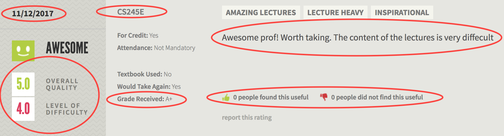

# Homework README

## Summary
For this assignment, I decided that I would like to scrape data from [RateMyProfessor](http://www.ratemyprofessors.com/), mainly to see if there are any interesting patterns there. For the unfamiliar, it's a website where students can review professors they've taken courses from, these reviews include ratings and various other pieces of information, see screenshot below:

The function I used is in the [dataframing.R](https://github.com/arsbar24/STAT545-hw-barton-alistair/blob/master/hw10/dataframing.R) file, and collects the circled pieces of information above for each review (in particular: the University, Department, Professor, Course, Difficulty, the overall rating, their comments, Date of review, how many people found it helpful/unhelpful, and the grade obtained by the reviewer).

## [Scraping function](https://github.com/arsbar24/STAT545-hw-barton-alistair/blob/master/hw10/dataframing.R)

Most of these were pretty simple to get, but there were a few exceptions:

* The university, department, and professor are not included in `class` tags, but had to be obtained from other html tags and parsed from longer strings using `substr()`.

* The grade is shown in letter grade form. This is fine, but I found it easier to convert to GPA for comparison purposes (I also replaced withdrawn and similar cases with `NA`)--same for difficulty and overall rating.

* The number of people who found a review helpful/unhelpful were listed in the same class, so I had to sort that out by even/odd indices.

* I also had to exit the function if there were no reviews of a professor, otherwise it would throw a spanner in the works as finding the odd/even indices would not work.

* Only up to 20 reviews are automatically listed for each professor; you can click to load more at the bottom of the screen. I couldn't find where this information was listed in the html, so I just took the 20 reviews. If anyone reading this knows how to get around this I would be interested in hearing.

## Scraping data

Once I had the function, I used a loop to cycle through the data corresponding to a few hundred professors. I managed this by noticing that each page is linked by a `tid` number, which covers a range between 7543 and 14937. I used `rbind()` to concatenate the data into one dataframe, then saved it to the [`rmp_data.csv`](https://github.com/arsbar24/STAT545-hw-barton-alistair/blob/master/hw10/rmp_data.csv) file. This is also included in the [dataframing.R](https://github.com/arsbar24/STAT545-hw-barton-alistair/blob/master/hw10/dataframing.R) file.

## [RMD file](https://github.com/arsbar24/STAT545-hw-barton-alistair/blob/master/hw10/ScrapingBy.md)

This file showcases a couple of ways to use the data.

## Makefile

I used a makefile in order to update my project to make it consistent before any uploads, but my project ended up having a much simpler structure than I anticipated, so I don't think it was necessary strictly speaking.

## Questions

There are a couple places where I solved a problem in a way that might be suboptimal:

* **Ordering grades:** The default way to do this is alphabetically, which puts A ahead of A+. I fixed this by converting to GPA via a case-by-case function, but there might be an easier way. 

* **Wrapping around the density kernel:** To figure out how frequent ratings are at different times of the year I converted my dates to a month-day format and gave a density plot. The problem with this is that the density plot doesn't account for reviews from January 1st in the density for December 31st, but I don't know how to make this work.

* **Loading all reviews:** (As mentioned above) RateMyProfessors only displays 20 reviews at a time. To load more you have click a button at the bottom of the page. I couldn't find out how to scrape these extra results. I would've like to have had them.

## Reflections

I found this project very interesting, even if the scraping function is a bit mechanical. I think I might see this as the most useful thing I learnt in this course as it gives me the tools to investigate a wide range of things under the proper motivation. I also enjoyed this assignment because I felt it allowed me to combine a lot of what I learnt in the first half of the course, refreshing my memory.