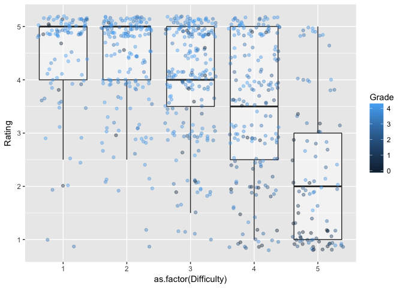

```r
knitr::opts_chunk$set(echo = TRUE)
options(knitr.table.format = 'markdown')
```


```r
library(readr)
suppressPackageStartupMessages(library(tidyverse))
```

```
## Warning: package 'purrr' was built under R version 3.4.2
```

```
## Warning: package 'dplyr' was built under R version 3.4.2
```

We begin by reading the scraped data:


```r
data <- suppressMessages(read_csv("rmp_data.csv"))
```

```
## Warning: Missing column names filled in: 'X1' [1]
```

## How do difficulty and quality correlate?

The first thing is to look for correlation between difficulty and overall rating:


```r
ggplot(data[complete.cases(data$Grade),], aes(x = as.factor(Difficulty), y = Rating)) + 
  geom_boxplot(alpha = 0.5, outlier.alpha = 0) + # outlier.alpha = 0 to avoid showing outliers here
  geom_jitter(aes(colour = Grade), alpha = 0.4)
```

<!-- -->

I remove people who didn't report their grade (using `complete.cases()`) since they tended to overwhelm those that did. We can clearly see that the difficulty rating of 5 seems to be mostly reserved for reviews from failing students who give the professors a bad overall rating as well (it may be that students reserve it for professors who they feel make the course more difficult than it should).

## What makes a professor difficult but good?

We might want to see what reasons someone would give for a good but difficult rating:


```r
hard <- filter(data, Difficulty == 5)
good <- filter(data, Rating == 5)

hardgood <- inner_join(hard, good)
```

```
## Joining, by = c("X1", "University", "Department", "Professor", "Course", "Difficulty", "Rating", "Comments", "Date", "Unhelpful", "Helpful", "Grade")
```

```r
head(hardgood$Comments)
```

```
## [1] "Hard but amazing teacher"                                                                                                                                                                                                                                                                    
## [2] "Bonnie is a great professor.  Hard as hell but you will learn a lot."                                                                                                                                                                                                                        
## [3] "She is demanding but of highest quality....by far the best I have had at Parkersburg."                                                                                                                                                                                                       
## [4] "Ignore the haters. Edwards is an amazing professor. Yeah, he yells but he will answer any question you ask and he has a zillion different ways of explaining things. If you do the homework, you should be okay on the quizzes and exams. I never liked math but I loved taking this course."
## [5] "Excellent instructor"                                                                                                                                                                                                                                                                        
## [6] "Best Prof ever ... truly illuminating."
```


## When do students rate the most?

We also might want to see how ratings correlate with the date, perhaps harder ratings occur in December and April when most universities have exams?


```r
data$Date <- data$Date %>% 
  format(format = "%m-%d") %>% 
  as.Date(format = "%m-%d")
```

```
## Warning in format.POSIXlt(as.POSIXlt(x), ...): unknown timezone 'default/
## America/Vancouver'
```

```r
ggplot(data, aes(x = Date)) + geom_density(alpha = 0.2, fill = 'blue')
```

<!-- -->

We can see that there's normally a lull at the beginning of the semester, before reviews pick up towards the end of it.

## Which department has students that complain the most?

I also want to use this data to find which department has the students that complain the most.


```r
depdata <- data %>% 
  group_by(Department) %>% 
  summarise(avg = mean(Difficulty), ratings = length(Difficulty))

knitr::kable(head(depdata))
```


|Department   |      avg| ratings|
|:------------|--------:|-------:|
|Accounting   | 3.276923|     130|
|Agriculture  | 1.900000|      20|
|Anthropology | 2.844660|     103|
|Architecture | 1.500000|       4|
|Biology      | 3.280000|      75|
|Business     | 3.150327|     153|

On first thought it might be tempting to say it's the department with the worst average, but Chemical Engineering departments only have 2 reviews (second place, Speech Pathology & Audiology only has 13), so clearly there's only a very small minority that likes to complain a lot. Next we might say that it's the department with the most reviews, but Communication has an average difficulty rating of 2.8; clearly Communication students like to communicate a lot, but not necessarily to complain (interestingly "Communication**s**" departments have a much worse difficulty rating, but very few ratings).

If we limit ourselves to the only those with more than 100 reviews we get: 


```r
depdata %>% 
  filter(ratings > 100) %>% 
  arrange(-avg) %>% 
  knitr::kable()
```


|Department        |      avg| ratings|
|:-----------------|--------:|-------:|
|Computer Science  | 3.450000|     140|
|Economics         | 3.381119|     286|
|History           | 3.288235|     340|
|Accounting        | 3.276923|     130|
|Political Science | 3.195804|     286|
|Science           | 3.178862|     246|
|Business          | 3.150327|     153|
|Philosophy        | 3.112903|     124|
|Mathematics       | 3.092537|     335|
|Psychology        | 3.036765|     272|
|English           | 3.025568|     352|
|Languages         | 2.994118|     170|
|Anthropology      | 2.844660|     103|
|Geography         | 2.823009|     113|
|Communication     | 2.792657|     463|
|Fine Arts         | 2.770335|     209|

It seems like one could make an argument for the most frequent complainers being from either Computer Science, Economics, or History. (Interestingly, physics and chemistry both have even higher average difficulty ratings than computer science but surprisingly have less than 40 reviews.)


