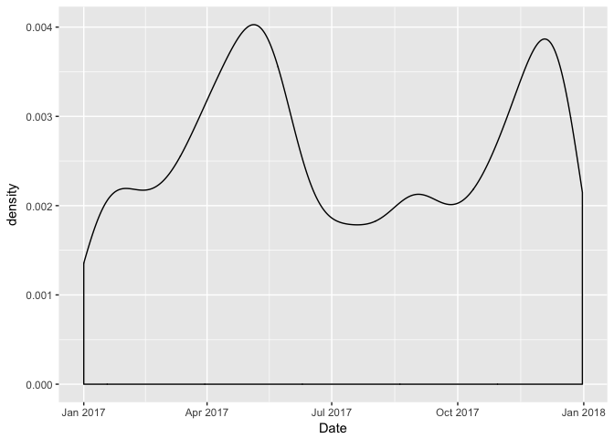

```r
library(readr)
suppressPackageStartupMessages(library(tidyverse))
```

```
## Warning: package 'purrr' was built under R version 3.4.2
```

```
## Warning: package 'dplyr' was built under R version 3.4.2
```

We begin by reading the scraped data:


```r
data <- read_csv("rmp_data.csv")[-1]
```

```
## Warning: Missing column names filled in: 'X1' [1]
```

```
## Parsed with column specification:
## cols(
##   X1 = col_integer(),
##   University = col_character(),
##   Professor = col_character(),
##   Course = col_character(),
##   Difficulty = col_double(),
##   OverallRating = col_double(),
##   Comments = col_character(),
##   Date = col_date(format = ""),
##   Unhelpful = col_integer(),
##   Helpful = col_integer(),
##   Grade = col_character()
## )
```

The first thing is to look for correlation between difficulty and overall rating:


```r
ggplot(data, aes(x = Difficulty, y = OverallRating)) + geom_jitter(aes(colour = Grade), alpha = 0.8) + geom_smooth()
```

```
## `geom_smooth()` using method = 'loess'
```

<!-- -->


We also might want to see how ratings correlate with the date, perhaps harder ratings occur in December and April when most universities have exams?


```r
data$Date <- data$Date %>% 
  format(format = "%m-%d") %>% 
  as.Date(format = "%m-%d")
```

```
## Warning in format.POSIXlt(as.POSIXlt(x), ...): unknown timezone 'default/
## America/Vancouver'
```

```r
ggplot(data, aes(x = Date, fill = OverallRating)) + geom_density()
```

<!-- -->

